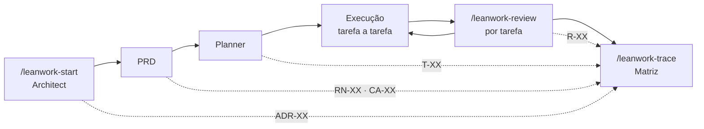

# Leanwork SDD — Projeto Demonstração (Encurtador de URL)

Este repositório é uma **demonstração completa do [Leanwork SDD](https://leanwork.github.io/leanwork-sdd/)**: um plugin de *Spec-Driven Development* para o **Claude Code** que conduz um projeto de software da arquitetura ao review, sem que a documentação e o código se soltem um do outro.

> Se você quer aprender a aplicar esse processo no seu próprio projeto .NET, é exatamente isso que eu ensino.
>
> **[Bootcamp Dev .NET IA 10x](https://aspnetpro.com.br/bootcamp-dev-net-ia-10x/)** — 4 lives ao vivo, o método completo
>
> **[Mentoria Dev .NET IA 10x](https://aspnetpro.com.br/mentoria-dev-net-ia-10x/)** — 12 semanas aplicando no seu projeto com acompanhamento individual

O projeto construído aqui é um encurtador de URL em .NET 10 — banal de propósito. **O produto real deste repositório não é o encurtador: é a cadeia de rastreabilidade `ADR → RN → CA → T → R`**, que conecta cada decisão de arquitetura a uma regra de negócio, a um critério de aceite, a uma tarefa, a um teste automatizado e a um relatório de review — de forma verificável por busca textual.

Se o pipeline de especificação só se justificasse em sistemas complexos, seria cerimônia de luxo. Este repositório existe para provar que ele funciona mesmo — sobretudo — num sistema que caberia num único arquivo.

---

## O que é o Leanwork SDD

Desenvolvimento com IA agêntica falha por dois motivos previsíveis: ou o agente recebe contexto de menos e inventa regra de negócio, ou recebe contexto demais e ignora o que importa. O Leanwork SDD ataca os dois lados — **primeiro especifica, depois executa**, e amarra tudo por IDs que sobrevivem à sessão de chat.

O plugin instala cinco *skills* e cinco *slash commands* no Claude Code:

| Skill | Comando | O que produz |
|---|---|---|
| `architect-leanwork` | `/leanwork-start` | Proposta arquitetural: atributos de qualidade, trade-offs, ADRs (`ADR-XX`), diagramas C4 em Mermaid |
| `prd-leanwork` | `/leanwork-start` | PRD com regras de negócio numeradas (`RN-XX`) e critérios de aceite em Gherkin PT-BR (`CA-XX`) |
| `planner-leanwork` | `/leanwork-start` | Plano de execução em tarefas (`T-XX`), cada uma declarando o que *implementa*, *valida* e quais *decisões base* materializa |
| `reviewer-leanwork` | `/leanwork-review` | Relatório de review por tarefa, com findings (`R-XX`) em Bloqueante / Importante / Sugestão |
| `context-leanwork` | `/leanwork-context` | O `CLAUDE.md` que dá contexto ao agente em toda sessão futura |
| — | `/leanwork-trace` | Matriz de rastreabilidade cruzando `ADR ↔ RN ↔ CA ↔ T ↔ R` |
| — | `/leanwork-next` | Inspeciona os artefatos existentes e diz em que fase o projeto está |

As skills são **stack-agnósticas**: descobrem a linguagem, os comandos e as convenções lendo o próprio repositório. O .NET aqui é escolha do estudo de caso, não requisito do plugin.

### O pipeline



A execução é interrompível de propósito: cada tarefa do plano é pequena o bastante para virar um commit, tem critério de aceite verificável e sabe quais testes precisa escrever. O agente pega uma tarefa, executa, e o `/leanwork-review` valida o resultado contra o plano, o PRD e a arquitetura — não contra o bom senso do momento.

---

## O que o pipeline gerou neste repositório

| Artefato | Caminho | Conteúdo |
|---|---|---|
| Proposta arquitetural | `docs/architecture/proposta-arquitetural.md` | 8 ADRs, atributos de qualidade, trade-offs, dívidas conscientes |
| PRD | `docs/prds/PRD-001-encurtador-url.md` | 16 regras de negócio, 17 critérios de aceite em Gherkin, escopo e não-escopo justificado |
| Plano de execução | `docs/plans/PLAN-001-encurtador-url.md` | 12 tarefas com dependências, pontos de validação humana e histórico de execução |
| Reviews | `docs/reviews/REVIEW-T-*.md` | 14 relatórios (12 tarefas + 2 rodadas de correção) |
| Matriz de rastreabilidade | `docs/traceability/MATRIX-encurtador-url.md` | Cadeia completa, navegável nos dois sentidos |
| Documento de entrega | `docs/ENTREGA-001-encurtador-url.md` | Evidência de conformidade, roteiro de aceite, limitações conhecidas |
| Contexto do agente | `CLAUDE.md` | Stack, comandos, convenções e restrições extraídas dos artefatos acima |

**~3.400 linhas de documentação para ~400 linhas de código de produção.** A proporção parece absurda até você notar que a documentação é o que permite que o código seja tão pequeno: cada corte de escopo foi decidido e registrado antes da primeira linha, e nenhuma linha foi escrita "por precaução".

---

## Benefícios da implementação

### 1. O projeto inteiro é consultável — por humanos e pela IA

Você não precisa ler 3.400 linhas para entender uma decisão. Pode abrir o documento certo **ou simplesmente perguntar ao Claude Code**, que lê os artefatos por você e responde com a citação da origem. É o benefício mais imediato e o mais subestimado: a documentação deixa de ser um arquivo morto e vira uma base de conhecimento interrogável. Ver a seção [Pergunte à IA sobre este projeto](#pergunte-à-ia-sobre-este-projeto).

### 2. A especificação não desliza silenciosamente

Todo critério de aceite vira um teste que carrega o ID no nome (`CA_12_CodigoExistente_RetornaTrezentosEDois`). Se alguém apagar a regra, o teste quebra com o ID do requisito estampado na falha. Não existe "o código diz uma coisa e o documento diz outra" — existe suíte vermelha.

### 3. O review pega o que o teste não pega

Em **T-09**, o reviewer detectou que `CriadoEm` voltava do SQLite com `DateTimeKind.Unspecified` em vez de `Utc` — exatamente o risco que a tarefa T-02 havia registrado semanas antes e nunca fechado. O finding está em `docs/reviews/REVIEW-T-09-2026-08-14.md`, e a ressalva só foi encerrada no round 2. Um review humano apressado teria aprovado; um review sem o plano em mãos nem saberia que o risco existia.

### 4. Onboarding deixa de depender de quem estava na sala

Quem chega depois não precisa reconstruir o "porquê" por arqueologia de commit. **Por que 302 e não 301?** ADR-004 responde, com a consequência que motivou a escolha. **Por que não tem painel admin?** PRD §4.2 responde, e a ausência se lê como decisão, não como pendência.

### 5. O agente de IA para de inventar

O `CLAUDE.md` gerado pelo pipeline informa ao Claude Code a stack, os comandos reais, as convenções (nomes em PT-BR, sufixo `Async`, testes nomeados pelo ID do CA) e as restrições (sem repositório genérico, sem CDN externo, redirect sempre 302). Cada sessão nova começa alinhada, sem você repetir o mesmo briefing.

### 6. A entrega é auditável sem confiança

Três comandos reproduzem a verificação inteira — não é preciso acreditar no documento:

```bash
dotnet test                              # 29/29 aprovados
grep -rc "CA_" tests/Encurtador.Tests/   # os 17 IDs de critério aparecem nos nomes dos testes
docker build -t encurtador . && docker run -p 8080:8080 encurtador
```

### 7. O escopo tem freio documentado

Não-objetivos declarados (painel admin, métricas, autenticação, alias customizado, expiração de link, deploy em cloud, escala horizontal) estão no PRD **com justificativa individual**. Quando alguém sugere "seria fácil adicionar...", a resposta já está escrita.

---

## Pergunte à IA sobre este projeto

Abra o Claude Code na raiz do repositório e faça a pergunta em português. O agente lê os artefatos e responde citando a origem — você não precisa saber em qual arquivo a resposta mora.

**Sobre regra de negócio:**

> *Qual regra impede que alguém encurte um link apontando para o próprio encurtador, e por quê?*
> → busca `RN-03` no PRD, o `CA-05` que a valida e o `ValidadorDeUrl` que a implementa.

> *Uma URL com 2048 caracteres exatos é aceita ou rejeitada?*
> → `RN-02` e `CA-04` respondem sem ambiguidade (aceita — o limite é inclusivo).

**Sobre decisão de arquitetura:**

> *Por que o redirect é 302 e não 301? Podemos trocar?*
> → `ADR-004` dá a justificativa (navegadores cacheiam 301 de forma persistente e o link fica impossível de corrigir) e o `CLAUDE.md` marca a decisão como não-negociável sem revisitar a ADR.

> *Por que não tem repositório genérico sobre o DbContext?*
> → `ADR-002`, com o trade-off explícito contra o atributo de qualidade "legibilidade".

**Sobre impacto de mudança:**

> *Se eu mudar o tamanho do código curto de 7 para 5 caracteres, o que quebra?*
> → o agente percorre `ADR-003 → RN-06 → CA-01 → T-06/T-09` e lista testes, documentos e arquivos afetados.

> *Quero adicionar expiração de link. Por onde começo?*
> → o pipeline responde: nova `RN`, novo `CA`, migration, tarefa no plano e review — nessa ordem.

**Sobre estado e histórico:**

> *Qual foi a última tarefa concluída e sobrou algum finding em aberto?*
> → histórico de execução no plano §11 + os relatórios em `docs/reviews/`.

> *O que foi deliberadamente deixado de fora e por quê?*
> → PRD §4.2 e a seção de limitações conhecidas do documento de entrega.

---

## O estudo de caso: o encurtador

Cola uma URL, recebe um link curto, o link curto redireciona. É isso.

### Stack

- **.NET 10 / ASP.NET Core** — Razor Pages (formulário) + Minimal API (`GET /{codigo}` para o redirect)
- **EF Core 10 + SQLite** (`shortener.db`, arquivo local, migration aplicada na inicialização — nunca `EnsureCreated()`)
- **xUnit + `Microsoft.AspNetCore.Mvc.Testing`** para testes de integração
- **Docker** (Dockerfile multi-stage) como único mecanismo de "deploy"

### Como rodar

Com Docker — recomendado, não exige o SDK .NET instalado:

```bash
docker build -t encurtador . && docker run -p 8080:8080 encurtador
```

Abra `http://localhost:8080`. Um contêiner novo sobe com o banco vazio e cria o schema sozinho — não há passo manual de configuração.

Sem Docker, com o .NET 10 SDK instalado:

```bash
dotnet run --project src/Encurtador.Web
```

**Persistência entre execuções:** por padrão o banco vive dentro do contêiner — removê-lo apaga os links criados. É uma dívida técnica consciente (`proposta-arquitetural.md` §9), aceitável porque o sistema é uma demo de palco. Para persistir, monte um bind mount e redirecione a connection string:

```bash
# bash / WSL / macOS / Linux
docker run -p 8080:8080 -v "$(pwd)/dados:/app/dados" -e ConnectionStrings__Default="Data Source=/app/dados/shortener.db" encurtador
```

```powershell
# PowerShell (Windows)
docker run -p 8080:8080 -v "${PWD}\dados:/app/dados" -e ConnectionStrings__Default="Data Source=/app/dados/shortener.db" encurtador
```

### Como rodar os testes

```bash
dotnet test
```

Roda a suíte inteira (29 testes) a partir da raiz, sem argumentos.

### Estrutura

```
.claude/skills/            as 5 skills do plugin Leanwork SDD
.claude/commands/          os 5 slash commands (/leanwork-start, /leanwork-review, ...)
.claude/templates/         convenções de ID e de estrutura de pastas do pipeline
docs/architecture/         proposta arquitetural (ADR-001 a ADR-008)
docs/prds/                 PRD com regras de negócio (RN-XX) e critérios de aceite (CA-XX)
docs/plans/                plano de execução (T-XX), com histórico por tarefa
docs/reviews/              um relatório REVIEW-T-XX por tarefa concluída
docs/traceability/         matriz gerada a partir dos artefatos acima
src/Encurtador.Web/        aplicação (Razor Pages + Minimal API + EF Core)
tests/Encurtador.Tests/    suíte xUnit — todo teste de critério carrega o ID no nome (CA_XX_...)
CLAUDE.md                  contexto do projeto para o agente de IA
Dockerfile                 build multi-stage: SDK compila e publica, runtime ASP.NET executa
```

---

## Rastreabilidade

A cadeia completa está em [`docs/traceability/MATRIX-encurtador-url.md`](docs/traceability/MATRIX-encurtador-url.md), gerada por `/leanwork-trace`. Resumo abaixo — cada linha é verificável por busca textual no repositório.

### Regra de negócio → critério de aceite → tarefa → decisão arquitetural

| RN | Regra (resumida) | CA | Tarefa | ADR |
|----|----|----|----|----|
| [RN-01](docs/prds/PRD-001-encurtador-url.md#8-regras-de-negócio) | Esquema `http`/`https` por allowlist | CA-02 | T-04 | ADR-005 |
| RN-02 | Limite de 2048 caracteres | CA-03, CA-04 | T-04 | ADR-005 |
| RN-03 | Rejeita destino no próprio host | CA-05 | T-05 | ADR-005 |
| RN-04 | Campo obrigatório, trim antes de validar | CA-06, CA-07 | T-04 | — |
| RN-05 | Ordem RN-04→01→02→03, short-circuit | CA-17 | T-05 | — |
| RN-06 | Código de 7 caracteres Base62, não enumerável | CA-01 | T-06, T-09 | ADR-003 |
| RN-07 | Unicidade garantida pelo banco, retry até 5x | CA-09, CA-10 | T-07 | ADR-003, ADR-002 |
| RN-08 | Mesma URL gera códigos distintos | CA-08 | T-07 | ADR-003 |
| RN-09 | Persiste código, URL de destino e `CriadoEm` em UTC | CA-01 | T-02, T-07, T-09 | — |
| RN-10 | HTTP 302 (nunca 301) para código existente | CA-12 | T-08 | ADR-004 |
| RN-11 | HTTP 404 para código inexistente | CA-13 | T-08 | ADR-004 |
| RN-12 | Código sensível a maiúsculas/minúsculas | CA-14 | T-08 | ADR-003 |
| RN-13 | Resolução não altera o registro | CA-15 | T-08 | — |
| RN-14 | Exibe a URL curta completa, pronta para cópia | CA-01 | T-09 | — |
| RN-15 | Preserva a entrada e a mensagem de erro em falha | CA-11 | T-09 | — |
| RN-16 | Migration aplicada na inicialização | CA-16 | T-03 | ADR-006 |

### Critério de aceite → teste automatizado

Os 17 critérios (`CA-01` a `CA-17`) têm teste xUnit com o ID no nome — busca `CA_` em `tests/Encurtador.Tests/` retorna todos.

| CA | Cenário | Teste |
|----|----|----|
| CA-01 | Encurtamento bem-sucedido | `EncurtamentoWebTests.CA_01_UrlValida_CriaLinkEExibeUrlCurtaCompleta` |
| CA-02 | Esquema ausente/não permitido (7 casos) | `ValidadorDeUrlTests.CA_02_UrlComEsquemaAusenteOuNaoPermitido_DeveSerRejeitada` |
| CA-03 | Acima do limite de caracteres | `ValidadorDeUrlTests.CA_03_UrlAcimaDoLimite_DeveSerRejeitada` |
| CA-04 | No limite exato | `ValidadorDeUrlTests.CA_04_UrlNoLimiteExato_DeveSerAceita` |
| CA-05 | Destino no próprio host | `ValidadorDeUrlTests.CA_05_DestinoNoProprioHost_DeveSerRejeitado` |
| CA-06 | Campo vazio | `ValidadorDeUrlTests.CA_06_CampoApenasComEspacos_DeveSerRejeitado` |
| CA-07 | Espaços nas extremidades removidos | `ValidadorDeUrlTests.CA_07_EspacosNasExtremidades_SaoRemovidos` |
| CA-08 | Mesma URL duas vezes gera códigos distintos | `ServicoDeEncurtamentoTests.CA_08_MesmaUrlEncurtadaDuasVezes_GeraCodigosDistintos` |
| CA-09 | Colisão resolvida por novo sorteio | `ServicoDeEncurtamentoTests.CA_09_ColisaoDeCodigo_ResolvidaPorNovoSorteio` |
| CA-10 | Tentativas esgotadas, nada é gravado | `ServicoDeEncurtamentoTests.CA_10_TentativasEsgotadas_FalhaSemGravar` |
| CA-11 | Formulário preserva a entrada em falha | `EncurtamentoWebTests.CA_11_UrlInvalida_PreservaEntradaEExibeMensagem` |
| CA-12 | Redirect 302 | `ResolucaoTests.CA_12_CodigoExistente_RetornaTrezentosEDois` |
| CA-13 | 404 para código inexistente | `ResolucaoTests.CA_13_CodigoInexistente_RetornaQuatrocentosEQuatro` |
| CA-14 | Case diferente não resolve | `ResolucaoTests.CA_14_CodigoComCaixaDiferente_NaoResolve` |
| CA-15 | Resolução não altera o registro | `ResolucaoTests.CA_15_ResolucaoNaoAlteraORegistro` |
| CA-16 | Primeira execução cria o banco | `InicializacaoTests.CA_16_PrimeiraExecucao_CriaBancoAutomaticamente` |
| CA-17 | Múltiplas violações, só a primeira mensagem | `ValidadorDeUrlTests.CA_17_EntradaComMultiplasViolacoes_ExibeApenasAPrimeira` |

### Decisões arquiteturais

As 8 ADRs estão em `docs/architecture/proposta-arquitetural.md` §5.

| ADR | Decisão | Onde aparece |
|-----|---------|---------------|
| ADR-001 | Aplicação única: Razor Pages para a tela, Minimal API para o redirect | `src/Encurtador.Web/Program.cs`, `Pages/Index.cshtml(.cs)` |
| ADR-002 | SQLite + EF Core, sem repositório genérico, índice único no código | `Dados/EncurtadorDbContext.cs` |
| ADR-003 | Código curto sorteado (não sequencial), 7 caracteres Base62 | `Servicos/GeradorDeCodigoBase62.cs`, RN-06/07/08/12 |
| ADR-004 | Redirect sempre 302, nunca 301 | `Program.cs` — `Results.Redirect(url, permanent: false)`, RN-10/11 |
| ADR-005 | Allowlist de esquema + limite de tamanho + bloqueio de host próprio | `Servicos/ValidadorDeUrl.cs`, RN-01/02/03 |
| ADR-006 | Migration aplicada na inicialização, nunca `EnsureCreated()` | `Program.cs`, RN-16 |
| ADR-007 | Empacotamento em imagem Docker multi-stage | `Dockerfile` |
| ADR-008 | Suíte xUnit com testes nomeados pelo ID do critério de aceite | convenção em todo `tests/Encurtador.Tests/**` |

ADR-001, ADR-007 e ADR-008 são decisões estruturais ou de processo — nenhuma `RN-XX` as cita diretamente, porque moldam a arquitetura da aplicação e a convenção de teste, não uma regra de negócio. **A lacuna foi registrada na matriz em vez de ser fechada com vínculo artificial** — que é, ela própria, uma demonstração do que o pipeline faz quando a meta não fecha ao pé da letra.

### Reviews

Cada tarefa concluída tem um relatório em `docs/reviews/REVIEW-T-XX-{data}.md`, com findings `R-XX` por severidade. Nenhuma tarefa ficou com finding Bloqueante em aberto — as duas rodadas com ressalva (T-01 e T-09) têm round 2 registrando a resolução.

---

## Usando o Leanwork SDD no seu projeto

O plugin e as instruções de instalação estão em **https://leanwork.github.io/leanwork-sdd/**. O fluxo típico, dentro do Claude Code:

```
/leanwork-start      descreva a demanda → arquitetura → PRD → plano
                     (execute as tarefas do plano, uma de cada vez)
/leanwork-review     após cada tarefa entregue
/leanwork-context    gera o CLAUDE.md a partir dos artefatos
/leanwork-trace      fecha a matriz de rastreabilidade
/leanwork-next       a qualquer momento: "em que fase eu estou?"
```

As convenções de ID e de estrutura de pastas estão em `.claude/templates/id-conventions.md` e `.claude/templates/folder-conventions.md`.

---

## Referências

- **Leanwork SDD** — https://leanwork.github.io/leanwork-sdd/
- Arquitetura: [`docs/architecture/proposta-arquitetural.md`](docs/architecture/proposta-arquitetural.md)
- PRD: [`docs/prds/PRD-001-encurtador-url.md`](docs/prds/PRD-001-encurtador-url.md)
- Plano de execução: [`docs/plans/PLAN-001-encurtador-url.md`](docs/plans/PLAN-001-encurtador-url.md)
- Matriz de rastreabilidade: [`docs/traceability/MATRIX-encurtador-url.md`](docs/traceability/MATRIX-encurtador-url.md)
- Documento de entrega: [`docs/ENTREGA-001-encurtador-url.md`](docs/ENTREGA-001-encurtador-url.md)

---

## Quer aplicar isso no seu projeto?

Este repositório mostra o método funcionando. Aprender a aplicar no seu próprio contexto — com as decisões certas e os erros que eu já cometi — é o próximo passo.

**🎯 [Bootcamp Dev .NET IA 10x]**
4 lives ao vivo com o método completo: setup, engenharia de contexto, MCPs, Lean Work SDD e arquitetura LMA.
→ https://aspnetpro.com.br/bootcamp-dev-net-ia-10x/

**🏆 [Mentoria Dev .NET IA 10x]**
12 semanas aplicando o método no seu projeto real, com acompanhamento individual.
→ https://aspnetpro.com.br/mentoria-dev-net-ia-10x/

---

**Michel Banagouro** — Co-Fundador & CTO, [Leanwork Group](https://www.linkedin.com/in/mbanagouro/)

dotnet  csharp  ai  claude  claude-code  spec-driven-development  sdd  agents  llm  dotnet10


