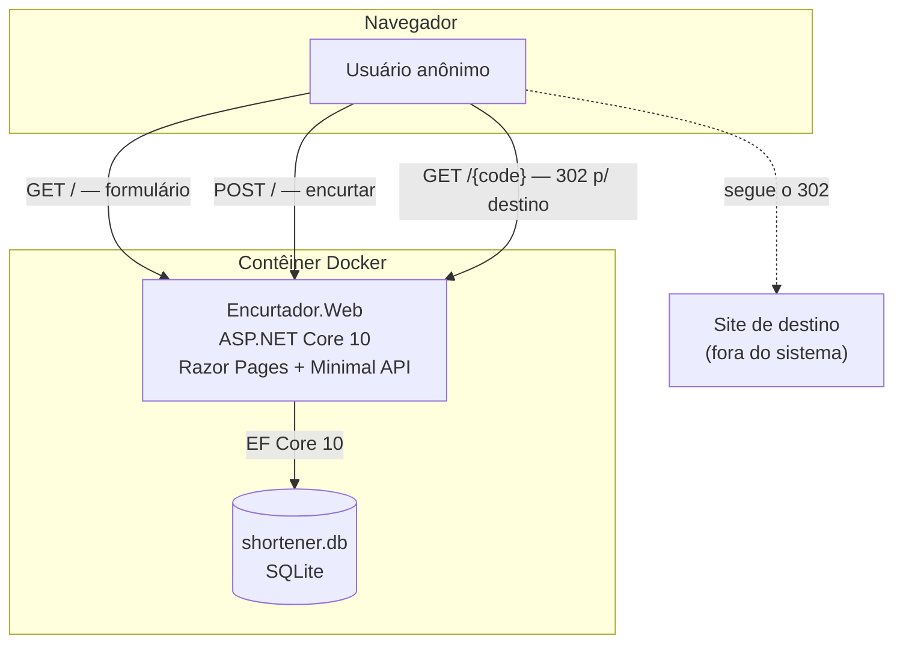
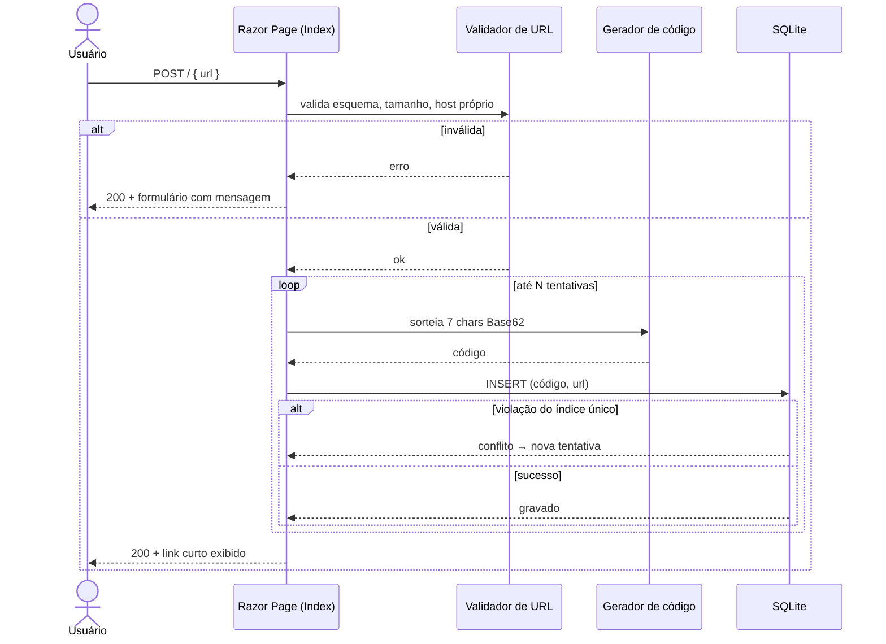
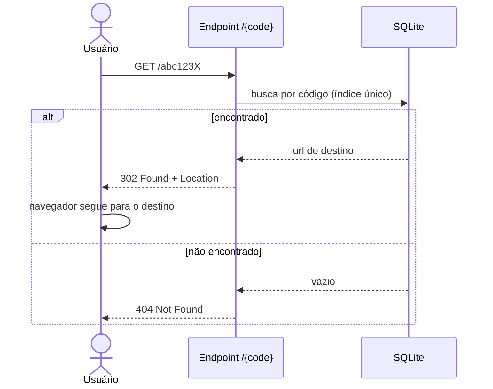

# Proposta Arquitetural — Encurtador de URL

> Cliente: interno Leanwork · Documento gerado em 14/08/2026 · Versão 0.1

## 1. Sumário executivo

Estamos construindo um **encurtador de URL**: o usuário cola um endereço longo, recebe um endereço curto, e quem acessa o curto é levado ao original.

A frase que justifica toda a arquitetura: **este sistema existe para tornar visível um processo, não para resolver um problema técnico difícil**. Ele é a demo do pipeline Leanwork SDD na palestra "Do PRD ao Deploy". Por isso a simplicidade não é uma concessão de prazo — é o requisito principal. Cada decisão aqui foi tomada para que uma pessoa consiga ler o sistema inteiro numa sessão e rastrear cada linha de código até uma regra de negócio escrita.

O domínio é deliberadamente banal, e isso é intencional: se o pipeline SDD só se justificasse em sistemas complexos, ele seria uma cerimônia de luxo. A demonstração é mais forte quando a rastreabilidade `ADR → RN → CA → T → R` aparece num sistema que caberia num arquivo — porque aí fica claro que o ganho vem do processo, não da complexidade que ele domestica.

**Riscos principais e mitigação:**

| Risco | Mitigação |
|---|---|
| A demo quebrar em palco por cache de navegador | Redirect com HTTP 302, nunca 301 (ADR-004) |
| Máquina do apresentador sem .NET 10 instalado | Imagem Docker autocontida (ADR-007) |
| O sistema virar vetor de phishing se exposto | Validação restritiva de esquema e host (ADR-005) |

**Ordem de grandeza:** dois projetos .NET (aplicação + testes), estimados em algumas centenas de linhas de código de produção. Sem custo de infraestrutura — roda em `localhost`, sem conta de cloud e sem dependência de rede.

---

## 2. Contexto e objetivos de negócio

### 2.1 Problema

O problema real não é encurtar URLs — esse problema está resolvido no mercado há vinte anos.

O problema é que a palestra "Do PRD ao Deploy" afirma que um pipeline de especificação (arquitetura → PRD → plano → review) torna a construção de software com IA **previsível**, e essa afirmação precisa de lastro. Sem um repositório onde a audiência consiga abrir o PRD, achar a regra `RN-03`, encontrar o critério `CA-05` que a valida, o teste que carrega esse ID e a tarefa `T-07` que a implementou, o argumento continua sendo slide.

Quem sente a dor: a audiência que sai da palestra convencida mas sem saber por onde começar na segunda-feira.

### 2.2 Objetivos de negócio

- Produzir um repositório público onde os quatro artefatos do pipeline SDD existam de verdade, amarrados por IDs, sobre um código que roda.
- Permitir que qualquer pessoa clone e execute o sistema com **um comando**, sem configuração prévia.
- Servir de material de apoio para a mentoria Dev .NET IA 10x, que usa a mesma stack da audiência.

### 2.3 Não-objetivos

Registrados explicitamente para impedir que decisões sejam tomadas em nome de requisitos que ninguém pediu:

- **Não** haverá painel administrativo, listagem de links ou tela de gestão.
- **Não** haverá métricas, contagem de cliques ou analytics.
- **Não** haverá autenticação, cadastro ou noção de "dono do link". Qualquer visitante encurta.
- **Não** haverá alias customizado ("quero que meu link seja `/leanwork`").
- **Não** haverá expiração, edição ou remoção de links.
- **Não** haverá deploy em cloud, domínio próprio ou HTTPS com certificado real.
- **Não** perseguiremos escala horizontal. Uma instância é o alvo declarado.

### 2.4 Usuários e cargas esperadas

Um usuário: o apresentador. Eventualmente, dezenas de pessoas que clonarem o repositório depois do evento, cada uma rodando a própria instância local.

Carga esperada: dezenas de requisições no total, não por segundo. Qualquer decisão tomada em nome de throughput neste sistema seria decisão tomada em nome de um requisito imaginário.

---

## 3. Atributos de qualidade prioritários

Três atributos dirigem as decisões. Os demais (disponibilidade, escalabilidade, resiliência) são explicitamente despriorizados — a seção 8 registra o que isso custa.

### 3.1 Legibilidade

- **Meta concreta**: o código de produção cabe em até 10 arquivos, e nenhum arquivo passa de ~120 linhas. Qualquer rota do sistema é compreensível sem navegar por mais de dois arquivos.
- **Por quê é prioritário**: sustenta o objetivo de servir como material didático. Um leitor que precisa atravessar cinco camadas de abstração para entender um redirect não vai enxergar a rastreabilidade — vai enxergar o framework.
- **Como a arquitetura atende**: monolito único sem separação artificial de camadas (ADR-001), acesso a dados direto via EF Core sem repositório genérico (ADR-002).

### 3.2 Reprodutibilidade

- **Meta concreta**: em máquina limpa com apenas Docker instalado, `docker build` seguido de `docker run` entrega o sistema funcionando. Sem string de conexão, sem variável de ambiente obrigatória, sem serviço externo, sem acesso à internet em tempo de execução.
- **Por quê é prioritário**: sustenta o objetivo de que a audiência consiga executar o projeto. Uma demo que exige `docker-compose up` de três serviços e uma credencial de cloud não é reproduzida por ninguém.
- **Como a arquitetura atende**: SQLite em arquivo, sem servidor de banco (ADR-002); imagem Docker multi-stage autocontida (ADR-007).

### 3.3 Rastreabilidade

Este é o atributo incomum, e é o motivo de o sistema existir.

- **Meta concreta**: 100% dos critérios de aceite do PRD têm um teste automatizado cujo nome carrega o ID do critério (`CA-XX`). Cada ADR desta proposta é referenciada por pelo menos uma regra de negócio do PRD.
- **Por quê é prioritário**: é a tese da palestra. Sem isso o repositório é um encurtador qualquer.
- **Como a arquitetura atende**: suíte xUnit com convenção de nomenclatura amarrada aos IDs (ADR-008), e escopo pequeno o bastante para que a cobertura dos critérios seja integral, não amostral.

---

## 4. Restrições

Dados de entrada, não variáveis a otimizar.

| Categoria | Restrição | Origem |
|---|---|---|
| Stack | .NET 10 com Razor Pages | Imposta pelo usuário — é a stack da audiência e da mentoria Dev .NET IA 10x |
| Persistência | SQLite via EF Core | Definida na entrevista |
| Empacotamento | Docker local. Sem cloud, sem custo recorrente | Definida na entrevista |
| Testes | xUnit, cobrindo os critérios de aceite | Definida na entrevista |
| Prazo | Palestra em 15/08/2026 | Data do LondrinaTech Meetup |
| Escopo | Sem painel, sem métricas, sem autenticação | Definida na entrevista |
| Time | 1 desenvolvedor conduzindo agente de IA | Contexto do projeto |

A escolha de .NET 10 + Razor Pages **não é uma decisão arquitetural** — é restrição declarada. Registramos aqui para que ninguém leia o documento e conclua que avaliamos alternativas de stack. Não avaliamos: a stack veio dada, e é coerente com o público.

---

## 5. Decisões arquiteturais (ADRs resumidos)

### ADR-001: Aplicação única em Razor Pages, com o redirect fora do roteamento de páginas

- **Contexto**: o sistema tem exatamente duas responsabilidades de entrega: renderizar um formulário HTML e responder um redirect HTTP. São naturezas diferentes — uma tem view, a outra não tem corpo de resposta.
- **Decisão**: adotamos um único projeto web. O formulário é uma Razor Page (`Pages/Index.cshtml`). O redirect é um endpoint Minimal API (`app.MapGet("/{code}", ...)`), registrado após o mapeamento das Razor Pages.
- **Justificativa**: atende **Legibilidade** (3.1). Separar frontend de API criaria dois projetos, um contrato HTTP e um problema de CORS para servir um formulário com um campo. Já modelar o redirect como Razor Page exigiria uma página com rota curinga `@page "/{code}"`, que competiria com todas as demais rotas do site e precisaria de lógica de exclusão — complexidade acidental gerada por forçar a abstração errada.
- **Alternativas consideradas**:
  - API .NET + SPA — descartada: dois artefatos deployáveis e um contrato HTTP para um formulário de um campo.
  - Redirect como Razor Page com rota curinga — descartada: conflito de roteamento com arquivos estáticos e com a própria home, resolvido só com regra de precedência frágil.
  - Arquitetura em camadas com projetos separados de domínio e infraestrutura — descartada: cinco projetos para três regras de negócio é cerimônia, e prejudica diretamente o atributo dominante.
- **Consequências**:
  - Positivas: um projeto, um deploy, um arquivo de configuração. O caminho completo de uma requisição é lido em dois arquivos.
  - Negativas: mistura dois estilos de endpoint no mesmo projeto, o que pode estranhar quem espera uniformidade. Mitigado por ser explícito nesta ADR.

### ADR-002: SQLite via EF Core, com índice único no código curto

- **Contexto**: o sistema precisa que um link criado sobreviva ao reinício da aplicação — um link demonstrado em palco não pode morrer se o processo reiniciar. Ao mesmo tempo, o atributo **Reprodutibilidade** (3.2) proíbe exigir um servidor de banco.
- **Decisão**: adotamos SQLite em arquivo, acessado por EF Core 10, com o `DbContext` injetado diretamente nas rotas. O campo do código curto recebe índice único.
- **Justificativa**: SQLite é o único banco relacional que satisfaz as duas restrições ao mesmo tempo — durabilidade sem processo servidor. O índice único cumpre dois papéis: garante no banco a unicidade que o gerador tenta garantir em memória (ADR-003), e torna a busca do redirect uma varredura de índice em vez de table scan, mantendo a latência do caminho crítico irrelevante mesmo sem cache.
- **Alternativas consideradas**:
  - Dicionário em memória — descartada: perde todos os links no restart, e elimina do projeto a camada de dados, que é justamente onde o plano de execução produz tarefas interessantes (migration, mapeamento, índice).
  - PostgreSQL em contêiner — descartada: obriga `docker-compose` e um segundo contêiner, violando a meta de "um comando" de 3.2.
  - Padrão Repository sobre o `DbContext` — descartada: o `DbContext` já é uma unidade de trabalho com repositórios. Envelopá-lo adiciona uma camada de indireção sem trocar nada de implementação, contra 3.1.
- **Consequências**:
  - Positivas: zero infraestrutura. O banco é um arquivo que pode ser apagado para resetar a demo.
  - Negativas: SQLite serializa escritas por arquivo, o que inviabiliza múltiplas instâncias compartilhando o mesmo banco. Aceito — escala horizontal é não-objetivo declarado (2.3).

### ADR-003: Código curto de 7 caracteres Base62, gerado aleatoriamente com retry em colisão

- **Contexto**: cada URL longa precisa de um identificador curto e único na rota. Há duas famílias de solução: derivar o código de um contador sequencial, ou sortear.
- **Decisão**: geramos 7 caracteres sorteados do alfabeto Base62 (`A-Z`, `a-z`, `0-9`) usando gerador criptograficamente seguro. Em violação do índice único, sorteamos de novo, com um teto de tentativas antes de falhar explicitamente.
- **Justificativa**: código sequencial codificado em Base62 é **enumerável** — quem recebe `/3` sabe que existem `/1` e `/2` e percorre todos os links já criados. Num sistema sem autenticação, onde qualquer visitante encurta (2.3), isso significa que todo link é público por construção. O sorteio custa um índice único e um retry, e elimina a enumeração. Com 62⁷ ≈ 3,5 trilhões de combinações, a colisão é rara o bastante para o retry nunca ser exercitado em produção — mas o caminho existe, é testável, e vira um critério de aceite concreto.
- **Alternativas consideradas**:
  - Sequencial codificado em Base62 — descartada: enumerável, conforme acima. Códigos seriam mais curtos, o que não é meta.
  - Hash da URL de origem (ex.: primeiros bytes de SHA-256) — descartada: torna o código determinístico, então a mesma URL sempre gera o mesmo código. Parece elegante, mas vaza informação (permite testar se uma URL específica já foi encurtada) e o tratamento de colisão fica mais confuso, não menos.
  - GUID — descartada: não é curto, e o produto se chama encurtador.
- **Consequências**:
  - Positivas: códigos não enumeráveis, geração sem coordenação, sem estado compartilhado.
  - Negativas: exige o retry e uma decisão sobre o teto de tentativas. Encurtar a mesma URL duas vezes gera dois códigos distintos — comportamento aceito e que será registrado como regra no PRD, não como defeito.

### ADR-004: Redirect com HTTP 302, nunca 301

- **Contexto**: o redirect é a operação central do produto. HTTP oferece 301 (Moved Permanently) e 302 (Found), e a escolha tem consequência operacional pesada.
- **Decisão**: o endpoint de redirect responde **302 Found**.
- **Justificativa**: navegadores cacheiam 301 de forma agressiva e persistente, frequentemente ignorando cabeçalhos de expiração. Uma vez que o navegador viu `/abc123 → 301 → destino`, ele deixa de consultar o servidor. Isso tem dois efeitos inaceitáveis aqui: (a) **em palco, a demo mente** — se um código for reutilizado ou o banco resetado, o navegador continua indo ao destino antigo, e o apresentador não tem como saber; (b) o link se torna irreversível, impossibilitando qualquer correção ou remoção futura. O 302 mantém toda requisição chegando ao servidor. O custo é uma ida à aplicação por acesso, o que é irrelevante na carga descrita em 2.4.
- **Alternativas consideradas**:
  - 301 Moved Permanently — descartada pelos motivos acima. É a escolha certa para migração de domínio, que não é o nosso caso: o destino não é permanente, é um dado mutável de banco.
  - 307/308 — descartadas: preservam o método HTTP, garantia que não precisamos, já que só atendemos GET.
- **Consequências**:
  - Positivas: o servidor mantém controle sobre todo acesso. A demo é confiável e repetível.
  - Negativas: uma requisição adicional por acesso. Aceito.

### ADR-005: Validação restritiva de URL por allowlist de esquema

- **Contexto**: encurtadores de URL são um vetor clássico de abuso, porque escondem o destino real do usuário. Ainda que este sistema não seja exposto publicamente, aceitar qualquer string como destino cria falhas concretas mesmo em uso local.
- **Decisão**: só aceitamos URIs absolutas com esquema `http` ou `https`, em allowlist. Rejeitamos qualquer outro esquema, rejeitamos URLs acima de 2048 caracteres, e rejeitamos destinos apontando para o próprio host do encurtador.
- **Justificativa**: a allowlist de esquema fecha a falha mais séria — um destino `javascript:` ou `data:text/html,...` armazenado e devolvido num redirect vira execução de script no contexto de quem clicou. Allowlist, e não blocklist, porque a lista de esquemas perigosos é aberta e a de esquemas que queremos é fechada e tem tamanho dois. O limite de 2048 caracteres alinha com o teto prático de navegadores e evita armazenar payloads arbitrários. O bloqueio do próprio host impede um laço de redirect infinito criado por acidente durante a demo.
- **Alternativas consideradas**:
  - Aceitar qualquer `Uri` absoluta válida — descartada: `javascript:alert(1)` é uma URI absoluta válida.
  - Blocklist de esquemas perigosos — descartada: exige prever o ataque, e falha silenciosamente para o esquema que ninguém lembrou.
  - Verificação de reputação do destino (ex.: Google Safe Browsing) — descartada: exige chave de API e acesso à internet em tempo de execução, violando 3.2. Registrada como dívida consciente (9).
- **Consequências**:
  - Positivas: três regras de validação claras, cada uma vira uma regra de negócio numerada no PRD e um teste unitário direto.
  - Negativas: não protege contra encurtar um link `https` genuinamente malicioso. Limitação conhecida e registrada.

### ADR-006: Migration aplicada na inicialização da aplicação

- **Contexto**: o banco é um arquivo que não existe no primeiro `docker run`. Alguém precisa criar o schema, e o atributo **Reprodutibilidade** (3.2) proíbe um passo manual antes do primeiro uso.
- **Decisão**: a aplicação aplica as migrations pendentes do EF Core na inicialização, antes de começar a atender requisições.
- **Justificativa**: é o que permite a promessa de um comando. Sem isso, `docker run` sobe uma aplicação que falha na primeira requisição, e a instrução de uso ganha um passo de `dotnet ef database update` que exige a ferramenta instalada na máquina do usuário.
- **Alternativas consideradas**:
  - `EnsureCreated()` — descartada: cria o schema sem registrar histórico de migrations, e não evolui. Some com o material didático da migration, que é uma tarefa legítima do plano de execução.
  - Migration como passo separado de deploy — descartada: é a prática correta em produção, e errada aqui. Adiciona um passo manual em nome de um cenário (deploy coordenado, múltiplas instâncias) que é não-objetivo declarado.
- **Consequências**:
  - Positivas: primeira execução funciona em máquina limpa.
  - Negativas: **é um antipadrão em produção real** — com múltiplas instâncias subindo em paralelo, duas tentariam migrar o mesmo banco simultaneamente. Registrado na seção 9 justamente porque a distância entre a decisão certa aqui e a certa em produção é boa matéria-prima para a palestra.

### ADR-007: Empacotamento em imagem Docker multi-stage

- **Contexto**: "deploy", no contexto desta demo, precisa significar algo verificável, e o prazo e a ausência de orçamento excluem cloud.
- **Decisão**: publicamos um `Dockerfile` multi-stage — um estágio com o SDK .NET 10 compila e publica, outro com apenas o runtime ASP.NET recebe o binário.
- **Justificativa**: cumpre a promessa do título da palestra com um artefato que qualquer pessoa reproduz, sem conta, sem credencial e sem custo. O multi-stage importa porque a imagem final não carrega o SDK — é a diferença entre uma imagem de ~110 MB e uma de mais de 800 MB, e é uma decisão explicável em trinta segundos no palco.
- **Alternativas consideradas**:
  - Azure Container Apps ou App Service — descartada: exige credencial, gera custo recorrente e adiciona um ponto de falha em rede na véspera do evento.
  - Apenas `dotnet run` — descartada: deixa a promessa do título sem lastro, e exige o SDK .NET 10 na máquina de quem clonar.
- **Consequências**:
  - Positivas: artefato portátil, sem dependência do SDK na máquina alvo.
  - Negativas: o arquivo SQLite vive dentro do contêiner. Sem volume montado, os links somem quando o contêiner é removido. Registrado na seção 9.

### ADR-008: Suíte xUnit com testes nomeados pelo ID do critério de aceite

- **Contexto**: o atributo **Rastreabilidade** (3.3) exige que a ligação entre especificação e código seja verificável por qualquer leitor, não apenas afirmada em documento.
- **Decisão**: adotamos xUnit em projeto separado. Testes de validação e geração de código são unitários, diretos sobre os serviços. Testes das rotas usam `WebApplicationFactory` com banco SQLite temporário por execução. **Todo teste que valida um critério de aceite carrega o ID do critério no nome** (ex.: `CA_02_UrlComEsquemaJavascript_DeveSerRejeitada`).
- **Justificativa**: a convenção de nomenclatura transforma a rastreabilidade em algo que se verifica com uma busca textual. Um leitor abre o PRD, pega `CA-02`, busca por `CA_02` no repositório e chega ao teste. Esse é o elo mais frágil da cadeia `ADR → RN → CA → T → R` em qualquer projeto, porque é o único que normalmente vive só na cabeça de quem escreveu. Aqui ele vira nome de método.
- **Alternativas consideradas**:
  - SpecFlow/Reqnroll com os arquivos `.feature` em Gherkin — descartada: seria a rastreabilidade mais literal possível, mas adiciona um gerador de código e uma camada de binding ao projeto, contra 3.1. O ganho de literalidade não paga a complexidade nesse tamanho de sistema.
  - Testes sem convenção de ID — descartada: destrói o atributo dominante do projeto.
  - Cobertura só de integração no caminho de redirect — descartada: deixaria as regras de validação (ADR-005) sem teste próprio, e são elas que produzem os critérios de aceite mais interessantes.
- **Consequências**:
  - Positivas: rastreabilidade auditável por busca textual. A suíte vira evidência, não promessa.
  - Negativas: renumerar um critério de aceite obriga a renomear testes. Aceito — em escala maior essa fricção justificaria automação, e vale a pena dizer isso no palco.

---

## 6. Visão arquitetural

> **Níveis utilizados**: apenas Container (Nível 2). O Nível 1 (Context) foi **omitido deliberadamente**: o diagrama de contexto deste sistema teria duas caixas — um usuário e o encurtador —, sem sistemas vizinhos, porque não há integração externa alguma. Desenhá-lo adicionaria uma figura sem informação. O Nível 3 (Component) também foi omitido: há um único container de aplicação, e seu interior tem três arquivos de lógica. O código é documentação mais fiel que o diagrama nesse nível de granularidade.
>
> Registrar a omissão importa mais que o diagrama omitido. A tentação em documentos de arquitetura é produzir todos os níveis porque o modelo tem quatro — e o resultado é diagrama decorativo, que ninguém mantém e todo mundo aprende a ignorar.

### 6.1 Contexto, em uma frase

Um usuário anônimo, pelo navegador, interage com o Encurtador de URL. O sistema não consome nem é consumido por nenhum sistema externo, não envia e-mail, não chama API de terceiro e não depende de rede após a inicialização.

### 6.2 Containers (C4 — Nível 2)

**`Encurtador.Web`** — único container deployável.
Responsabilidade: servir o formulário, validar e persistir URLs, e resolver códigos curtos em redirects.
Tecnologia: ASP.NET Core 10, Razor Pages para a única tela, Minimal API para o endpoint de redirect (ADR-001).
Deploy: imagem Docker multi-stage, uma instância (ADR-007).

**`shortener.db`** — arquivo SQLite.
Responsabilidade: guardar o par código curto ↔ URL de destino, com a data de criação.
Tecnologia: SQLite acessado por EF Core 10, schema criado por migration na inicialização (ADR-002, ADR-006).
Deploy: arquivo dentro do contêiner. Sem volume montado por padrão — decisão consciente registrada na seção 9.

O "Site de destino" aparece pontilhado porque **não é uma dependência do sistema**. A aplicação nunca faz requisição a ele: ela devolve um 302 e o navegador do usuário é quem segue. Essa distinção é o que mantém o sistema livre de qualquer chamada de saída — e, por consequência, imune a toda uma classe de problemas (timeout de terceiro, SSRF, indisponibilidade em cascata) que um encurtador que validasse destinos teria de enfrentar.

---

## 7. Fluxos críticos

### 7.1 Encurtar uma URL

O laço de retry é o único ponto não-trivial do sistema, e existe por causa da ADR-003: como o código é sorteado e não sequencial, a unicidade não é garantida na geração — é garantida pelo banco, e a aplicação reage ao conflito. A alternativa (consultar antes de inserir) tem condição de corrida entre a consulta e a escrita; deixar o índice único decidir não tem.

Note que a resposta de sucesso é **200 com o formulário repopulado**, não um redirect pós-POST. É uma escolha de simplicidade: o link curto precisa ser exibido para ser copiado, e mantê-lo na mesma resposta evita ter de carregá-lo via query string ou TempData.

### 7.2 Resolver um código curto

Fluxo curto de propósito — é o caminho crítico do produto e não deve ter nada no meio. Duas decisões estão materializadas aqui: o **302** em vez de 301 (ADR-004), que mantém toda visita passando pelo servidor, e o **404** para código inexistente em vez de redirect para a home. O 404 é a resposta honesta: a home não é o recurso pedido, e mascarar o erro com um redirect impediria distinguir "link não existe" de "link existe e aponta para a home".

---

## 8. Trade-offs assumidos

- **Simplicidade × escalabilidade horizontal** — priorizamos simplicidade, sem meio-termo. SQLite em arquivo e migration na inicialização (ADR-002, ADR-006) tornam múltiplas instâncias inviáveis. É o custo consciente de rodar com um comando e zero infraestrutura, e escala é não-objetivo declarado (2.3).

- **Latência do redirect × capacidade de corrigir um link** — priorizamos a capacidade de correção. O 302 (ADR-004) custa uma ida ao servidor por acesso que o 301 pouparia. Em troca, nenhum link fica preso no cache do navegador — o que protege a demo e mantém os dados sob controle da aplicação.

- **Códigos curtos × códigos não enumeráveis** — priorizamos não-enumerabilidade. Sequencial daria códigos de 1 a 3 caracteres nos primeiros milhares de links; sorteamos 7 (ADR-003) para que ninguém consiga percorrer os links alheios num sistema sem autenticação.

- **Fidelidade a práticas de produção × clareza didática** — priorizamos clareza, e nomeamos onde isso nos afasta da prática correta. Migration na inicialização e ausência de repositório são decisões que **não** recomendaríamos num sistema real com múltiplas instâncias e testes de unidade sobre a camada de dados. Estão aqui porque o atributo dominante é legibilidade, e porque a diferença entre os dois contextos é ela própria conteúdo da palestra.

- **Cobertura de teste × escopo da suíte** — priorizamos cobrir **todos** os critérios de aceite antes de cobrir qualquer outra coisa. Não haverá teste de infraestrutura, de Dockerfile ou de renderização de view. A suíte existe para provar a rastreabilidade (3.3), não para maximizar percentual de cobertura — que é, aliás, exatamente o argumento do bloco de abertura da palestra sobre os 87%.

---

## 9. Dívidas técnicas conscientes

**Persistência efêmera no contêiner**
O arquivo SQLite vive no sistema de arquivos do contêiner (ADR-007). Sem volume, remover o contêiner apaga todos os links.
*Quando vira problema*: em qualquer uso que ultrapasse uma sessão de demonstração.
*Como pagar*: montar bind mount ou volume nomeado apontando para o diretório do banco. É uma linha no comando de execução, e será documentada no README.

**Migration aplicada na inicialização**
Prática deliberadamente errada para produção (ADR-006).
*Quando vira problema*: no momento em que existir mais de uma instância — duas réplicas subindo juntas disputam a migração do mesmo banco.
*Como pagar*: extrair para um passo de deploy dedicado ou um init container.

**Sem limite de taxa**
Qualquer cliente pode criar links num laço, sem restrição.
*Quando vira problema*: no primeiro minuto de exposição pública na internet.
*Como pagar*: middleware de rate limiting nativo do ASP.NET Core, por IP.

**Sem verificação de reputação do destino**
A validação (ADR-005) garante que o destino é `http`/`https`, não que é seguro. Um link de phishing legítimo em HTTPS passa.
*Quando vira problema*: em exposição pública. Encurtadores são vetor de phishing precisamente por ocultarem o destino.
*Como pagar*: integração com Google Safe Browsing ou equivalente, aceitando a dependência de rede e de chave de API que hoje rejeitamos.

**Sem expiração ou limpeza**
A tabela cresce indefinidamente; não há como remover um link.
*Quando vira problema*: em escala real, ou no primeiro pedido de remoção por abuso.
*Como pagar*: coluna de expiração e uma tarefa agendada. É a extensão mais natural do sistema, e boa candidata a exercício de mentoria.

**Observabilidade limitada ao log padrão**
Sem métricas, sem tracing, sem health check.
*Quando vira problema*: quando alguém precisar operar isso sem estar com o terminal aberto na frente.
*Como pagar*: endpoint de health check e OpenTelemetry — ambos triviais de adicionar em ASP.NET Core, e omitidos aqui por escopo (2.3).

---

## 10. Riscos e mitigações

| Risco | Impacto | Probabilidade | Mitigação |
|---|---|---|---|
| Cache de navegador falsear o comportamento durante a demonstração | Alto | Alta se usássemos 301 | 302 em vez de 301 (ADR-004); aba anônima como procedimento de palco |
| Máquina alvo sem SDK .NET 10 | Médio | Média | Imagem Docker autocontida (ADR-007) |
| Prazo — palestra em 15/08/2026 | Alto | Média | Escopo agressivamente cortado (2.3); pipeline entrega tarefas independentes, e o sistema é útil como demo mesmo parcialmente implementado |
| O código gerado pelo agente divergir da especificação | Alto | Média | É o risco que o próprio pipeline endereça: convenção de IDs nos testes (ADR-008) e fase de review contra PRD e arquitetura |
| Reutilizar um código curto após resetar o banco confundir a demonstração | Baixo | Baixa | Consequência já neutralizada pelo 302; resetar o banco é apagar o arquivo |

---

## 11. Próximos passos

Sequência lógica de validação, não cronograma:

1. **Aprovar esta proposta.** As ADRs viram os IDs que o PRD vai referenciar — mudar depois custa retrabalho nos dois documentos.
2. **Produzir o PRD** (skill `prd-leanwork`): hierarquia Epic → Feature → PBI, regras de negócio `RN-XX` derivadas principalmente das ADR-003, ADR-004 e ADR-005, e critérios de aceite `CA-XX` em Gherkin.
3. **Produzir o plano de execução** (skill `planner-leanwork`): tarefas `T-XX` declarando o que implementam (RN), o que validam (CA) e que decisão materializam (ADR).
4. **Executar tarefa a tarefa** com o agente, rodando `/leanwork-review` ao fim de cada uma para gerar os findings `R-XX`.
5. **Verificar a cadeia completa** `ADR → RN → CA → T → R` no repositório final — é o artefato que sustenta o argumento da palestra, e precisa fechar de ponta a ponta em pelo menos um exemplo apresentável.

---

## 12. Apêndice — Aspectos não cobertos

- **Estimativa de esforço e cronograma** → fora do escopo desta skill; o plano de execução trata a ordem, não a duração.
- **Detalhes de UI e experiência** → o PRD define o comportamento da tela; o visual segue o brand guide Leanwork sem documento próprio.
- **Threat modeling completo** → a ADR-005 cobre as ameaças relevantes ao escopo declarado. Um sistema exposto publicamente exigiria análise dedicada, e a seção 9 lista o que faltaria.
- **Estratégia de branching e CI** → fora do escopo; a demo roda em `main` com commits por tarefa, o que também facilita mostrar a evolução do repositório.
- **Backup e recuperação** → não aplicável a um sistema cujo banco é descartável por design.
