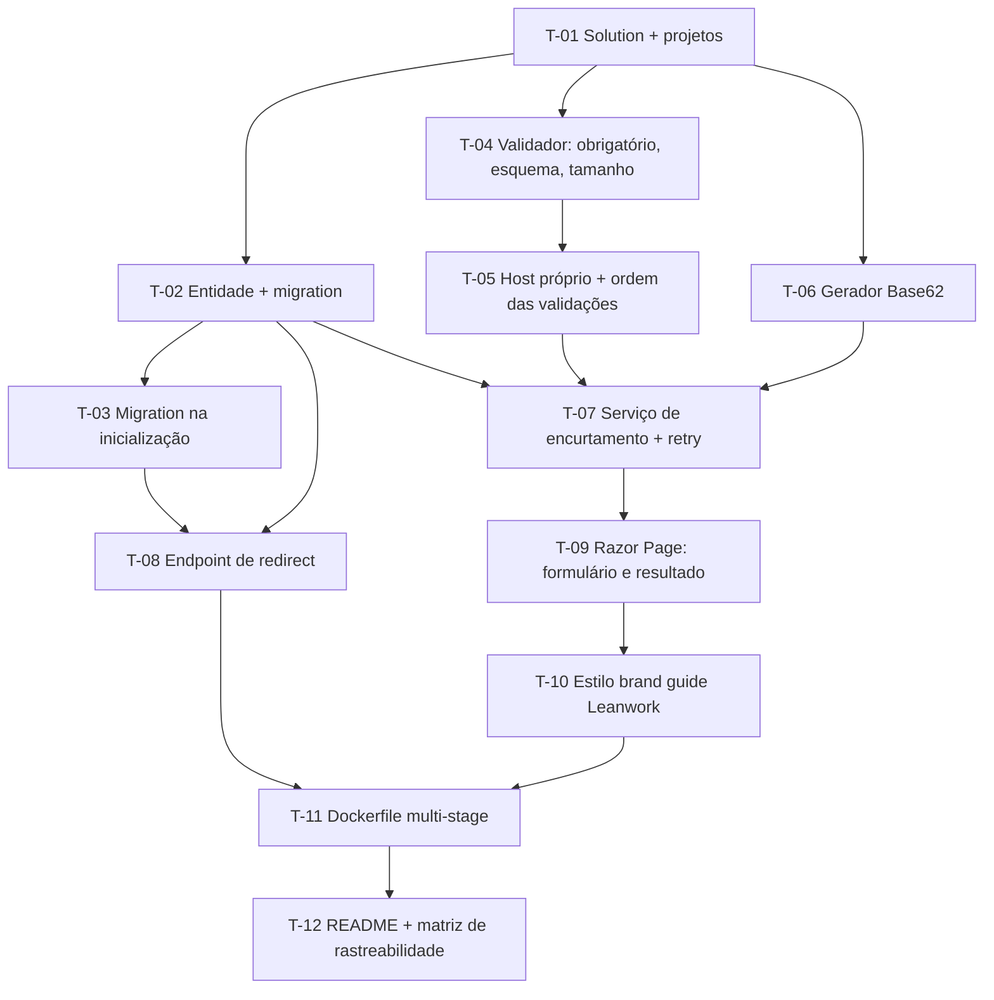

# Plano de Execução: Encurtador de URL

**PRD de referência:** `docs/prds/PRD-001-encurtador-url.md` (Aprovado)
**Arquitetura de referência:** `docs/architecture/proposta-arquitetural.md` (v0.1, ADR-001 a ADR-008)
**Cliente/Produto:** Interno Leanwork — demo da palestra "Do PRD ao Deploy"
**Stack:** .NET 10, ASP.NET Core Razor Pages, EF Core 10, SQLite, xUnit, Docker
**Autor:** Michel Banagouro
**Data:** 2026-08-14
**Status:** Concluído — 12/12 tarefas executadas e revisadas, fechado em 2026-08-17

---

## 1. Resumo executivo

Construção greenfield de um encurtador de URL em doze tarefas, organizadas de dentro para fora: primeiro a fundação (projetos, entidade, migration), depois as regras de negócio isoladas em serviços testáveis por unidade, então a resolução do link curto, a tela e por último o empacotamento Docker.

A ordem das fases é deliberadamente interrompível. Ao fim da **Fase 3** o sistema está completo e provado por testes — só não tem tela. Ao fim da **Fase 4** ele é demonstrável. A Fase 5 entrega a promessa do título da palestra. Se o tempo apertar, cortar da última para trás preserva um sistema coerente em qualquer ponto de parada.

A regra que governa a quebra: **nenhuma tarefa termina sem os testes que carregam os IDs dos critérios de aceite que ela fecha** (ADR-008). Teste não é fase separada neste plano — é parte da definição de pronto de cada tarefa, porque a rastreabilidade é o produto.

## 2. Estratégia de entrega

**Modelo de entrega:** única release, execução incremental por fase, um commit por tarefa.

Sem feature flag, sem dark launch, sem staging: o sistema não tem usuários em produção e o "deploy" é uma imagem Docker executada localmente (ADR-007). O commit por tarefa não é cerimônia — é o que permite mostrar em palco a evolução do repositório amarrada às tarefas do plano.

**Critério geral de "pronto":**

- Os 17 critérios de aceite do PRD (CA-01 a CA-17) têm teste xUnit com o ID no nome, e a suíte passa inteira.
- As 16 regras de negócio (RN-01 a RN-16) estão implementadas e rastreáveis a uma tarefa deste plano.
- `docker build` seguido de `docker run` sobe o sistema em máquina com apenas Docker instalado, sem nenhum passo de configuração.
- A cadeia `ADR → RN → CA → T → teste` fecha de ponta a ponta e está documentada no README.

## 3. Premissas e decisões

> ⚠️ **Premissa:** a palestra é em 15/08/2026 — a execução tem uma janela curta. As fases estão ordenadas para que uma interrupção em qualquer ponto deixe o sistema íntegro, e não para maximizar paralelismo.

> ⚠️ **Premissa:** execução conduzida por agente de IA com revisão humana nos pontos da seção 9. As tarefas são escritas com critério de aceite explícito porque o executor não tem instinto para desconfiar de ambiguidade.

> ⚠️ **Premissa:** o host do link curto é o host da requisição (PRD §13). Nenhuma tarefa introduz configuração de domínio público.

Decisões técnicas fixadas antes da execução, complementando as ADRs:

- **Decisão:** a geração de código fica atrás da interface `IGeradorDeCodigo`, e o serviço de encurtamento depende da abstração. — *materializa ADR-003 e ADR-008; sem essa costura, CA-09 e CA-10 não têm teste determinístico, e a meta de 100% de cobertura dos critérios cai.*
- **Decisão:** layout `src/Encurtador.Web` + `tests/Encurtador.Tests` com `Encurtador.sln` na raiz. — *convenção padrão .NET; permite `dotnet test` na raiz sem argumentos.*
- **Decisão:** a tela segue o brand guide Leanwork (monocromático, Figtree). — *a demo é projetada em tela grande ao lado dos slides; coerência visual é parte do argumento.*
- **Decisão:** validação de URL em um serviço próprio, não em `DataAnnotations` do model. — *RN-05 exige ordem determinística de avaliação com uma mensagem por vez, e `DataAnnotations` não garante ordem entre atributos.*

## 4. Mapa de dependências

T-04 e T-06 não dependem da camada de dados — podem ser executadas logo após T-01, em paralelo com T-02 e T-03 se houver mais de um executor.

## 5. Fases

### Fase 1 — Fundação e persistência

**Objetivo da fase:** ter uma aplicação que sobe, cria o próprio banco e tem onde gravar links.

**Critério de conclusão da fase:** `dotnet run` sobe a aplicação em máquina limpa, o arquivo do banco é criado com o schema aplicado, e `dotnet test` executa (ainda que com poucos testes).

---

#### T-01 — Criar solution, projeto web e projeto de testes

- [x] **Status:** Concluída
- **Complexidade:** Baixa
- **Depende de:** nenhuma
- **Implementa:** —
- **Valida:** —
- **Decisões base:** ADR-001 *(aplicação única)*, ADR-008 *(xUnit em projeto separado)*
- **Camadas/arquivos afetados:**
  - `Encurtador.sln` *(novo)*
  - `src/Encurtador.Web/Encurtador.Web.csproj` *(novo)*
  - `src/Encurtador.Web/Program.cs` *(novo)*
  - `src/Encurtador.Web/Pages/Index.cshtml` + `.cshtml.cs` *(novo, esqueleto)*
  - `tests/Encurtador.Tests/Encurtador.Tests.csproj` *(novo)*
  - `.gitignore` *(novo)*

**Descrição:**
Criar a solution com o projeto web ASP.NET Core 10 no template Razor Pages e o projeto de testes xUnit referenciando o web. O projeto de testes precisa do pacote `Microsoft.AspNetCore.Mvc.Testing` já nesta tarefa, porque os testes de rota das tarefas seguintes dependem de `WebApplicationFactory` — e descobrir isso no meio da T-08 custa uma interrupção. Adicionar `Microsoft.EntityFrameworkCore.Sqlite` e `Microsoft.EntityFrameworkCore.Design` ao projeto web. O `.gitignore` precisa cobrir `bin/`, `obj/` e `*.db`.

**Critério de aceite (testável):**
- [x] `dotnet build` na raiz compila os dois projetos sem warning
- [x] `dotnet test` na raiz executa a suíte (vazia, mas verde)
- [x] `dotnet run --project src/Encurtador.Web` serve a página inicial

**Testes a escrever:**
- *Não aplicável* — tarefa estrutural.

**Riscos / pontos de atenção:**
- Confirmar que o SDK instalado é .NET 10 antes de começar (`dotnet --version`). Todo o plano assume isso.
- O `InternalsVisibleTo` não é necessário: os serviços serão `public`, porque o projeto de testes é externo e não vale distorcer visibilidade por causa de teste.

---

#### T-02 — Criar entidade Link, DbContext e migration inicial com índice único

- [x] **Status:** Concluída
- **Complexidade:** Baixa
- **Depende de:** T-01
- **Implementa:** RN-09 *(estrutura dos três dados persistidos)*
- **Valida:** —
- **Decisões base:** ADR-002 *(SQLite + EF Core, índice único no código)*
- **Camadas/arquivos afetados:**
  - `src/Encurtador.Web/Dados/Link.cs` *(novo)*
  - `src/Encurtador.Web/Dados/EncurtadorDbContext.cs` *(novo)*
  - `src/Encurtador.Web/Migrations/` *(gerado)*
  - `src/Encurtador.Web/Program.cs` *(editado — registro do DbContext)*

**Descrição:**
Entidade `Link` com `Id` (chave, autoincremento), `Codigo` (obrigatório, 7 caracteres), `UrlDestino` (obrigatório, máximo 2048) e `CriadoEm` (`DateTime` em UTC). Mapeamento via `OnModelCreating` no próprio `DbContext` — sem classe de configuration separada, porque é uma entidade só e a indireção não paga (ADR-002, atributo de legibilidade). O índice em `Codigo` é **único**: é ele que garante RN-07 no banco, e a aplicação vai reagir à violação em T-07. Registrar o `DbContext` com a connection string apontando para um arquivo `shortener.db`, sem exigir variável de ambiente.

**Critério de aceite (testável):**
- [x] `dotnet ef migrations add InicialLinks` gera migration com a tabela e o índice único em `Codigo`
- [x] O SQL da migration contém `CREATE UNIQUE INDEX` sobre a coluna do código
- [x] A aplicação sobe sem connection string em variável de ambiente

**Testes a escrever:**
- *Não aplicável* — tarefa estrutural. A unicidade é exercitada em T-07 (CA-09, CA-10).

**Riscos / pontos de atenção:**
- SQLite não tem tipo nativo de data. Gravar `DateTime` em UTC e garantir que a leitura volte como UTC — o `DateTimeKind` se perde no round-trip se não for tratado. Afeta CA-01.
- **Ponto de validação humana:** revisar o SQL gerado antes de commitar (seção 9).

---

#### T-03 — Aplicar migrations pendentes na inicialização

- [x] **Status:** Concluída
- **Complexidade:** Baixa
- **Depende de:** T-02
- **Implementa:** RN-16
- **Valida:** CA-16
- **Decisões base:** ADR-006 *(migration na inicialização)*
- **Camadas/arquivos afetados:**
  - `src/Encurtador.Web/Program.cs` *(editado)*
  - `tests/Encurtador.Tests/InicializacaoTests.cs` *(novo)*
  - `tests/Encurtador.Tests/Suporte/EncurtadorWebApplicationFactory.cs` *(novo)*

**Descrição:**
Antes de `app.Run()`, abrir um escopo, resolver o `DbContext` e chamar `Database.Migrate()`. Precisa acontecer antes de a aplicação aceitar a primeira requisição — é isso que sustenta a promessa de um comando (ADR-006). Usar `Migrate()`, nunca `EnsureCreated()`: o segundo cria o schema sem registrar histórico e apaga do projeto o material didático da migration.

**Critério de aceite (testável):**
- [x] CA-16 verde: com o arquivo do banco inexistente, subir a aplicação cria o schema e um encurtamento funciona sem passo manual
- [x] Subir a aplicação uma segunda vez, com o banco já criado, não gera erro nem duplica schema

**Testes a escrever:**
- *Integration:* `CA_16_PrimeiraExecucao_CriaBancoAutomaticamente` — usar `WebApplicationFactory` apontando para um arquivo temporário inexistente, subir e verificar que a tabela existe e aceita insert.

**Riscos / pontos de atenção:**
- Os testes de integração das tarefas seguintes precisam de banco isolado por execução (ADR-008). Estabelecer aqui o helper de factory com arquivo temporário, porque T-07, T-08 e T-09 vão reutilizá-lo. Se cada tarefa criar o seu, a suíte vira colcha de retalhos.

---

### Fase 2 — Regras de encurtamento

**Objetivo da fase:** ter validação, geração de código e persistência de link funcionando e provadas por teste, sem nenhuma tela.

**Critério de conclusão da fase:** CA-02 a CA-10 verdes. É possível encurtar uma URL chamando o serviço diretamente, e todas as regras de rejeição estão cobertas.

---

#### T-04 — Implementar validação de obrigatoriedade, esquema e tamanho da URL

- [x] **Status:** Concluída
- **Complexidade:** Média
- **Depende de:** T-01
- **Implementa:** RN-01, RN-02, RN-04
- **Valida:** CA-02, CA-03, CA-04, CA-06, CA-07
- **Decisões base:** ADR-005 *(allowlist de esquema)*
- **Camadas/arquivos afetados:**
  - `src/Encurtador.Web/Servicos/ValidadorDeUrl.cs` *(novo)*
  - `src/Encurtador.Web/Servicos/ResultadoValidacao.cs` *(novo)*
  - `tests/Encurtador.Tests/ValidadorDeUrlTests.cs` *(novo)*

**Descrição:**
Serviço que recebe a string informada e devolve um resultado com sucesso/falha e a mensagem exata da tabela do PRD §8. Nesta tarefa entram três validações, nesta ordem: (1) obrigatoriedade após `Trim()` — o trim acontece antes de tudo e o valor aparado é o que segue adiante (RN-04); (2) `Uri.TryCreate` com `UriKind.Absolute` **e** verificação de que o esquema está na allowlist `{http, https}` (RN-01); (3) comprimento máximo de 2048, com o limite inclusivo (RN-02).

A allowlist é o ponto crítico: `Uri.TryCreate` com `UriKind.Absolute` aceita `javascript:alert(1)` e `file:///etc/passwd` como URIs absolutas válidas. Validar só o `TryCreate` deixa a falha mais séria do sistema aberta.

**Critério de aceite (testável):**
- [x] CA-02 verde para as sete entradas do Esquema do Cenário, incluindo `//exemplo.com.br` e `google.com` (sem esquema explícito)
- [x] CA-03 e CA-04 verdes: 2049 caracteres rejeita, 2048 exatos aceita
- [x] CA-06 e CA-07 verdes: string de espaços rejeita, espaços nas extremidades são removidos antes de validar

**Testes a escrever:**
- *Unit:* `CA_02_UrlComEsquemaAusenteOuNaoPermitido_DeveSerRejeitada` como `[Theory]` com as sete entradas do PRD; `CA_03_UrlAcimaDoLimite_DeveSerRejeitada`; `CA_04_UrlNoLimiteExato_DeveSerAceita`; `CA_06_CampoApenasComEspacos_DeveSerRejeitado`; `CA_07_EspacosNasExtremidades_SaoRemovidos`.
- As mensagens retornadas são asseridas literalmente contra a tabela do PRD §8 — mensagem é regra, não detalhe de UI.

**Riscos / pontos de atenção:**
- O limite de 2048 se aplica à URL **após** o trim. Um teste com 2048 caracteres mais espaços nas pontas precisa passar.
- Cuidado com a ordem entre esquema e tamanho: CA-17 (em T-05) exige que uma entrada `javascript:` com 3000 caracteres devolva apenas a mensagem de esquema. Já implementar esquema antes de tamanho evita retrabalho.

---

#### T-05 — Implementar rejeição de destino no próprio host e consolidar a ordem das validações

- [x] **Status:** Concluída
- **Complexidade:** Média
- **Depende de:** T-04
- **Implementa:** RN-03, RN-05
- **Valida:** CA-05, CA-17
- **Decisões base:** ADR-005 *(bloqueio de laço de redirect)*
- **Camadas/arquivos afetados:**
  - `src/Encurtador.Web/Servicos/ValidadorDeUrl.cs` *(editado)*
  - `tests/Encurtador.Tests/ValidadorDeUrlTests.cs` *(editado)*

**Descrição:**
Estender o validador com o quarto passo: rejeitar destino cujo host seja igual ao host da requisição que está criando o link (RN-03). O host da requisição entra como parâmetro do método — o validador não conhece `HttpContext`, quem injeta o contexto é a página (T-09). Manter isso fora do serviço é o que permite testar CA-05 sem subir a aplicação.

Fechar a ordem `RN-04 → RN-01 → RN-02 → RN-03` com short-circuit na primeira falha (RN-05), e cobrir com um teste que prova a ordem, não só o resultado.

**Critério de aceite (testável):**
- [x] CA-05 verde: host `curto.local` recebendo `https://curto.local/aB3xK9p` é rejeitado com a mensagem específica
- [x] CA-17 verde: entrada com esquema `javascript:` e 3000 caracteres devolve apenas a mensagem de esquema, e nunca a de tamanho
- [x] A comparação de host ignora diferença de maiúsculas/minúsculas e desconsidera a porta

**Testes a escrever:**
- *Unit:* `CA_05_DestinoNoProprioHost_DeveSerRejeitado`; `CA_17_EntradaComMultiplasViolacoes_ExibeApenasAPrimeira`.
- *Unit complementar:* host com caixa diferente (`CURTO.local`) também é rejeitado.

**Riscos / pontos de atenção:**
- Host é case-insensitive por definição de DNS, ao contrário do código curto (RN-12), que é case-sensitive. As duas comparações vivem no mesmo sistema e seguem regras opostas — é exatamente o tipo de detalhe que um agente uniformiza por engano.

---

#### T-06 — Implementar gerador de código Base62 atrás de IGeradorDeCodigo

- [x] **Status:** Concluída
- **Complexidade:** Baixa
- **Depende de:** T-01
- **Implementa:** RN-06
- **Valida:** —
- **Decisões base:** ADR-003 *(código sorteado, não sequencial)*, ADR-008 *(costura para teste determinístico)*
- **Camadas/arquivos afetados:**
  - `src/Encurtador.Web/Servicos/IGeradorDeCodigo.cs` *(novo)*
  - `src/Encurtador.Web/Servicos/GeradorDeCodigoBase62.cs` *(novo)*
  - `tests/Encurtador.Tests/GeradorDeCodigoBase62Tests.cs` *(novo)*
  - `src/Encurtador.Web/Program.cs` *(editado — registro do gerador como singleton)*

**Descrição:**
Interface com um método `Gerar()` que devolve string, e a implementação que sorteia 7 caracteres do alfabeto Base62 usando `RandomNumberGenerator` (criptograficamente seguro, não `Random`). A interface existe para que T-07 possa ser testada com um gerador falso que devolve códigos controlados — sem ela, CA-09 e CA-10 dependeriam de uma colisão com probabilidade de 1 em 3,5 trilhões.

Usar `RandomNumberGenerator.GetInt32` por índice do alfabeto, não redução por módulo sobre bytes — módulo sobre 256 introduz viés de distribuição nos primeiros caracteres do alfabeto. Detalhe pequeno, errado com frequência, e que num sistema sobre não-enumerabilidade merece estar certo.

**Critério de aceite (testável):**
- [x] Todo código gerado tem exatamente 7 caracteres, todos pertencentes a `A-Z a-z 0-9`
- [x] Mil gerações consecutivas não produzem repetição
- [x] O gerador não depende de estado compartilhado nem de semente fixa

**Testes a escrever:**
- *Unit:* `Gerador_ProduzCodigoDeSeteCaracteresBase62`; `Gerador_NaoRepeteEmMilGeracoes`.
- Sem ID de CA no nome: RN-06 é verificada dentro de CA-01, em T-09. Estes testes são de robustez do serviço, não de critério de aceite.

**Riscos / pontos de atenção:**
- Registrar a implementação no DI como singleton — `RandomNumberGenerator` é thread-safe nos métodos estáticos usados aqui.

---

#### T-07 — Implementar serviço de encurtamento com retry em colisão

- [x] **Status:** Concluída
- **Complexidade:** Alta
- **Depende de:** T-02, T-05, T-06
- **Implementa:** RN-07, RN-08, RN-09
- **Valida:** CA-08, CA-09, CA-10
- **Decisões base:** ADR-003 *(unicidade garantida pelo banco)*, ADR-002 *(índice único)*
- **Camadas/arquivos afetados:**
  - `src/Encurtador.Web/Servicos/ServicoDeEncurtamento.cs` *(novo)*
  - `src/Encurtador.Web/Servicos/ResultadoEncurtamento.cs` *(novo)*
  - `src/Encurtador.Web/Program.cs` *(editado — registro de `ServicoDeEncurtamento` como `Scoped`)*
  - `tests/Encurtador.Tests/ServicoDeEncurtamentoTests.cs` *(novo)*
  - `tests/Encurtador.Tests/Suporte/GeradorFalso.cs` *(novo)*

**Descrição:**
Serviço que recebe a URL já validada e persiste o link. O laço: sorteia código, tenta `SaveChanges`, e em violação do índice único sorteia outro — até 5 tentativas (RN-07). Esgotadas, devolve falha com a mensagem genérica e **nada é gravado**.

A unicidade é decidida pelo banco, não por consulta prévia: verificar se o código existe antes de inserir cria janela de corrida entre a leitura e a escrita. Deixar o índice único falhar e reagir à exceção não tem essa janela. Capturar `DbUpdateException` e inspecionar se é violação de unicidade — não engolir qualquer `DbUpdateException` como colisão, senão um erro real de banco vira retry silencioso.

Após uma falha de `SaveChanges`, a entidade fica no change tracker em estado inconsistente: descartar a entrada antes da próxima tentativa, ou o segundo `SaveChanges` tenta gravar as duas.

**Critério de aceite (testável):**
- [x] CA-08 verde: a mesma URL encurtada duas vezes gera dois códigos distintos que resolvem para o mesmo destino
- [x] CA-09 verde: com o gerador devolvendo um código existente na primeira tentativa, o serviço sorteia de novo e conclui a gravação
- [x] CA-10 verde: com o gerador sempre devolvendo código existente, o serviço desiste após 5 tentativas, devolve a mensagem genérica e não grava nada

**Testes a escrever:**
- *Integration (banco SQLite temporário):* `CA_08_MesmaUrlEncurtadaDuasVezes_GeraCodigosDistintos`; `CA_09_ColisaoDeCodigo_ResolvidaPorNovoSorteio`; `CA_10_TentativasEsgotadas_FalhaSemGravar`.
- O `GeradorFalso` recebe uma fila de códigos e os devolve em ordem — é o que torna CA-09 e CA-10 determinísticos.
- Assertion explícita de contagem de registros em CA-10: "não gravou nada" precisa ser verificado, não presumido.

**Riscos / pontos de atenção:**
- É a única tarefa não-trivial do sistema (arquitetura §7.1). Se algo vai dar errado na execução, é aqui.
- `CriadoEm` em UTC (RN-09) — usar `DateTime.UtcNow`, e conferir o round-trip no SQLite conforme o risco levantado em T-02.
- **Ponto de validação humana:** revisar o tratamento da exceção de unicidade antes de seguir para a Fase 3 (seção 9).

---

### Fase 3 — Resolução do link curto

**Objetivo da fase:** fechar o caminho crítico do produto — um código curto leva ao destino.

**Critério de conclusão da fase:** CA-12 a CA-15 verdes. O sistema está funcionalmente completo e provado por testes; falta só a tela.

---

#### T-08 — Implementar endpoint GET /{code} com 302 e 404

- [x] **Status:** Concluída
- **Complexidade:** Média
- **Depende de:** T-02, T-03
- **Implementa:** RN-10, RN-11, RN-12, RN-13
- **Valida:** CA-12, CA-13, CA-14, CA-15
- **Decisões base:** ADR-004 *(302, nunca 301)*, ADR-001 *(redirect como Minimal API, fora do roteamento de páginas)*
- **Camadas/arquivos afetados:**
  - `src/Encurtador.Web/Program.cs` *(editado)*
  - `tests/Encurtador.Tests/ResolucaoTests.cs` *(novo)*

**Descrição:**
`app.MapGet("/{codigo}", ...)` registrado **após** `MapRazorPages()`, buscando o código por igualdade exata e devolvendo `Results.Redirect(url, permanent: false)` quando encontra, ou `Results.NotFound()` quando não (ADR-001, ADR-004).

O `permanent: false` é a decisão inteira da ADR-004 num parâmetro: `true` emitiria 301, o navegador cachearia de forma persistente, e a demo passaria a mentir em palco após um reset do banco. Vale um comentário de uma linha no código apontando a ADR — é o único lugar do sistema onde um parâmetro booleano carrega tanto peso.

RN-12 e RN-13 não pedem código adicional: a comparação exata já é case-sensitive por padrão no SQLite para colunas sem `COLLATE NOCASE`, e uma consulta de leitura não escreve. As duas são **invariantes verificadas por teste**, e é justamente por serem "óbvias" que precisam de teste — são as que quebram em silêncio quando alguém adiciona um contador de cliques depois.

**Critério de aceite (testável):**
- [x] CA-12 verde: código existente devolve 302 com `Location` apontando para o destino
- [x] CA-13 verde: código inexistente devolve 404, sem redirect para a home
- [x] CA-14 verde: `/ab3xk9p` não resolve um link gravado como `aB3xK9p`
- [x] CA-15 verde: três acessos seguidos deixam o registro idêntico ao original

**Testes a escrever:**
- *Integration (WebApplicationFactory):* `CA_12_CodigoExistente_RetornaTrezentosEDois`; `CA_13_CodigoInexistente_RetornaQuatrocentosEQuatro`; `CA_14_CodigoComCaixaDiferente_NaoResolve`; `CA_15_ResolucaoNaoAlteraORegistro`.
- O cliente de teste precisa ser criado com `AllowAutoRedirect = false`, senão o `HttpClient` segue o 302 e o teste assere o status da página de destino em vez do redirect. É o erro mais comum nesta tarefa.
- Em CA-12, asserir o status **302 exato**, não `IsRedirect` genérico — a diferença entre 301 e 302 é a ADR-004 inteira, e um assert frouxo deixaria a regressão passar.

**Riscos / pontos de atenção:**
- A rota curinga `/{codigo}` compete com arquivos estáticos e com a home. Registrar depois de `MapRazorPages()` e conferir que `/` continua servindo a página e que `/css/site.css` continua sendo servido.
- Confirmar que a coluna do código **não** foi criada com `COLLATE NOCASE` em T-02 — se foi, CA-14 falha e a correção é uma migration nova.

---

### Fase 4 — Interface

**Objetivo da fase:** tornar o sistema utilizável e apresentável por um humano no navegador.

**Critério de conclusão da fase:** CA-01 e CA-11 verdes, e a tela projetada em tela grande é legível a distância.

---

#### T-09 — Implementar a Razor Page com formulário, resultado e mensagens de erro

- [x] **Status:** Concluída
- **Complexidade:** Média
- **Depende de:** T-07
- **Implementa:** RN-14, RN-15
- **Valida:** CA-01, CA-11
- **Decisões base:** ADR-001 *(formulário como Razor Page)*
- **Camadas/arquivos afetados:**
  - `src/Encurtador.Web/Pages/Index.cshtml` *(editado)*
  - `src/Encurtador.Web/Pages/Index.cshtml.cs` *(editado)*
  - `tests/Encurtador.Tests/EncurtamentoWebTests.cs` *(novo)*

**Descrição:**
`OnGet` renderiza o formulário vazio. `OnPost` extrai o host da requisição, chama o validador (T-05) e, passando, o serviço de encurtamento (T-07). Em sucesso, monta a URL curta **completa** — esquema, host e código — e a exibe com um controle de cópia (RN-14). Em falha, reexibe o formulário com o valor digitado preservado e a mensagem da regra violada (RN-15).

A resposta de sucesso é **200 com a mesma página**, não um redirect pós-POST (PRD §7.1): o link precisa estar visível para ser copiado, e carregá-lo via TempData custaria mais do que resolve.

**Critério de aceite (testável):**
- [x] CA-01 verde end-to-end: POST com URL válida grava o link e a resposta contém a URL curta completa com o host da requisição
- [x] CA-11 verde: POST com `google.com` devolve 200, o campo continua preenchido com `google.com` e a mensagem de esquema aparece
- [x] O controle de cópia coloca a URL curta completa na área de transferência (`navigator.clipboard.writeText`, confirmado em navegador real — seção 9, 2026-08-14)

**Testes a escrever:**
- *Integration (WebApplicationFactory):* `CA_01_UrlValida_CriaLinkEExibeUrlCurtaCompleta`; `CA_11_UrlInvalida_PreservaEntradaEExibeMensagem`.
- Em CA-01, asserir também o formato do código (7 caracteres Base62) e a gravação de `CriadoEm` em UTC — é o cenário que valida RN-06 e RN-09 end-to-end.

**Riscos / pontos de atenção:**
- A API de área de transferência (`navigator.clipboard`) exige contexto seguro: funciona em `localhost` e em HTTPS, mas falha se a demo for aberta por IP na rede local. Testar no endereço que será usado em palco.
- O antiforgery token do Razor Pages precisa ser tratado nos testes de POST — extrair o token do GET anterior antes de postar.

---

#### T-10 — Aplicar o brand guide Leanwork à tela

- [x] **Status:** Concluída
- **Complexidade:** Baixa
- **Depende de:** T-09
- **Implementa:** —
- **Valida:** —
- **Decisões base:** —
- **Camadas/arquivos afetados:**
  - `src/Encurtador.Web/wwwroot/css/site.css` *(editado)*
  - `src/Encurtador.Web/Pages/Shared/_Layout.cshtml` *(editado)*
  - `src/Encurtador.Web/wwwroot/css/figtree.css` *(novo — fonte embarcada)*
  - `src/Encurtador.Web/wwwroot/lib/**` *(removido — vendor Bootstrap/jQuery órfão após tirar as referências do `_Layout.cshtml`)*
  - `src/Encurtador.Web/Pages/Shared/_Layout.cshtml.css` *(removido — CSS isolado só de classes Bootstrap)*
  - `src/Encurtador.Web/Pages/Shared/_ValidationScriptsPartial.cshtml` *(removido — não referenciado em lugar nenhum)*

**Descrição:**
Paleta monocromática (preto, branco, cinza), tipografia Figtree, layout centrado com bastante respiro. A fonte entra **embarcada em `wwwroot`**, não via CDN — a arquitetura exige que o sistema funcione sem acesso à internet em tempo de execução (§3.2), e um `@import` do Google Fonts quebra essa promessa exatamente no palco, onde o Wi-Fi do evento é a variável menos confiável da noite.

Tarefa sem rastreabilidade a RN ou CA, e isso é proposital: nenhuma regra de negócio depende dela. Existe porque a demo é projetada ao lado dos slides, e incoerência visual custa credibilidade num argumento sobre cuidado com o processo.

**Critério de aceite (testável):**
- [x] A tela usa apenas preto, branco e tons de cinza
- [x] A fonte carrega com a máquina desconectada da internet (verificável desligando o Wi-Fi)
- [x] O campo, o botão e a URL curta são legíveis a três metros de uma tela projetada

**Testes a escrever:**
- *Não aplicável* — apresentação. A suíte não testa renderização de view (arquitetura §8).

**Riscos / pontos de atenção:**
- Não introduzir framework CSS. Uma tela, um formulário, um resultado — Bootstrap aqui seria mais linhas de dependência do que de estilo, contra o atributo de legibilidade.
- O template padrão do Razor Pages já traz Bootstrap: removê-lo do `_Layout.cshtml` faz parte da tarefa.

---

### Fase 5 — Empacotamento e documentação

**Objetivo da fase:** cumprir a promessa do título — `docker run` e o sistema sobe — e deixar a cadeia de rastreabilidade legível para quem clonar.

**Critério de conclusão da fase:** em máquina com apenas Docker, `docker build` + `docker run` entregam o sistema funcionando, e o README permite percorrer `ADR → RN → CA → T → teste` sem abrir o código.

---

#### T-11 — Criar Dockerfile multi-stage

- [x] **Status:** Concluída
- **Complexidade:** Média
- **Depende de:** T-08, T-10
- **Implementa:** —
- **Valida:** —
- **Decisões base:** ADR-007 *(imagem Docker multi-stage)*
- **Camadas/arquivos afetados:**
  - `Dockerfile` *(novo)*
  - `.dockerignore` *(novo)*

**Descrição:**
Estágio de build sobre a imagem do SDK .NET 10 que restaura, compila e publica; estágio final sobre a imagem de runtime ASP.NET que recebe apenas o publicado. O `.dockerignore` precisa excluir `bin/`, `obj/` e `*.db` — sem ele, um banco local vaza para dentro da imagem e a demo sobe com links de teste da máquina do apresentador.

O multi-stage é a diferença entre ~110 MB e mais de 800 MB, e é uma decisão explicável em trinta segundos no palco (ADR-007).

**Critério de aceite (testável):**
- [x] `docker build -t encurtador .` conclui sem erro
- [x] `docker run -p 8080:8080 encurtador` sobe a aplicação, e encurtar + resolver funcionam no navegador
- [x] A imagem final não contém o SDK (`docker images` mostra tamanho compatível com runtime)
- [x] Um contêiner novo, sem volume, sobe com o banco vazio e cria o schema sozinho

**Testes a escrever:**
- *Não aplicável* — não há teste automatizado de Dockerfile (arquitetura §8). A verificação é manual, pelos critérios acima.

**Riscos / pontos de atenção:**
- Fixar a porta exposta e conferir que a aplicação escuta nela dentro do contêiner (`ASPNETCORE_HTTP_PORTS`). É onde o `docker run` costuma subir e não responder.
- **Ponto de validação humana:** executar de fato o build e o run antes de marcar a tarefa. É a tarefa cujo critério de aceite não tem teste automatizado — marcar sem executar é onde o plano mente.

---

#### T-12 — Escrever README com instruções de execução e matriz de rastreabilidade

- [x] **Status:** Concluída
- **Complexidade:** Baixa
- **Depende de:** T-11
- **Implementa:** —
- **Valida:** —
- **Decisões base:** ADR-008 *(rastreabilidade auditável por busca textual)*
- **Camadas/arquivos afetados:**
  - `README.md` *(novo)*

**Descrição:**
README com: o que é o projeto e por que existe, como rodar com Docker em um comando, como rodar os testes, e a **matriz de rastreabilidade** `ADR → RN → CA → T → teste` em tabela. Documentar também como persistir o banco entre execuções via bind mount — é a dívida consciente registrada na arquitetura §9, e o README é onde ela foi prometida.

A matriz é o artefato que sustenta o argumento da palestra. Sem ela, quem clona o repositório vê um encurtador; com ela, vê o pipeline. O comando `/leanwork-trace` pode gerar a base da tabela.

**Critério de aceite (testável):**
- [x] Uma pessoa com apenas Docker consegue subir o sistema seguindo o README, sem consultar outro arquivo
- [x] A matriz cobre as 16 RNs e os 17 CAs, cada linha apontando para a tarefa e o teste correspondentes
- [x] Cada ADR aparece na matriz ligada a pelo menos uma RN *(ressalva registrada: ADR-001 e ADR-008 são decisões estruturais/de processo sem RN direta — documentado como lacuna esperada, não corrigida por invenção de vínculo artificial)*

**Testes a escrever:**
- *Não aplicável* — documentação.

**Riscos / pontos de atenção:**
- Não duplicar o conteúdo do PRD no README: referenciar por ID e link. Documento duplicado é documento que diverge.

---

## 6. Testes transversais

- [ ] **Verificação de cobertura dos critérios:** buscar `CA_` no projeto de testes e conferir que os 17 IDs (`CA_01` a `CA_17`) aparecem ao menos uma vez. É a métrica de sucesso do PRD §3, e se verifica com uma busca textual (ADR-008).
- [ ] **Smoke test manual em palco:** com a imagem Docker rodando e o navegador em aba anônima, encurtar uma URL real, abrir o link curto, apagar o banco, subir de novo e confirmar que o link antigo devolve 404 — prova o comportamento do 302 (ADR-004) ao vivo.
- [ ] **Execução em máquina limpa:** rodar `docker build` + `docker run` em uma máquina sem SDK .NET, confirmando a promessa de reprodutibilidade (arquitetura §3.2).

## 7. Checklist de prontidão

Adaptado ao contexto: não há produção, staging, PO nem QA — o checklist genérico de release seria cerimônia vazia aqui. O que precisa ser verdadeiro:

- [ ] Os 17 CAs têm teste com o ID no nome, e `dotnet test` passa inteiro
- [ ] As 16 RNs estão implementadas e mapeadas na matriz do README
- [ ] `docker build` + `docker run` validados em máquina sem SDK .NET
- [ ] Fonte e CSS funcionam com a máquina desconectada da internet
- [ ] Um commit por tarefa, com o ID `T-XX` na mensagem
- [ ] Matriz `ADR → RN → CA → T → teste` fecha de ponta a ponta
- [ ] Ensaio da demo feito no notebook e no projetor que serão usados

## 8. Rollback e contingência

Não há produção a reverter. A migration é greenfield e forward-only, e resetar o estado é apagar o arquivo `shortener.db`.

A contingência real é de **escopo**, não de rollback: se a execução não fechar antes da palestra, a ordem das fases permite parar em qualquer ponto com o sistema íntegro. Fase 3 completa já demonstra o pipeline inteiro (a criação de links via teste, a resolução via navegador); Fase 4 torna a demo confortável; Fase 5 cumpre o título. Cortar da última para trás.

## 9. Pontos de validação humana

O executor é um agente de IA. Nestes pontos, parar e pedir confirmação antes de seguir:

- [x] **Após T-02** — revisar o SQL da migration antes de commitar, confirmando o `CREATE UNIQUE INDEX` e a ausência de `COLLATE NOCASE` na coluna do código. Um erro aqui só aparece em CA-14, cinco tarefas adiante. Confirmado pelo autor em 2026-08-14 (histórico §11, T-02).
- [x] **Após T-07** — revisar o tratamento da exceção de unicidade e o descarte do change tracker entre tentativas. É a única lógica não-trivial do sistema. Confirmado pelo autor em 2026-08-14 (histórico §11, T-07).
- [x] **Após T-09** — abrir a tela no navegador e encurtar uma URL manualmente. Teste verde com tela quebrada é possível, e a tela é o que vai para o projetor. Confirmado pelo autor em 2026-08-14.
- [x] **Após T-10** — abrir a tela no navegador (ou no equipamento de projeção) e confirmar que campo, botão e URL curta são legíveis a três metros. Confirmado pelo autor em 2026-08-14.
- [x] **Durante T-11** — executar `docker build` e `docker run` de verdade. O critério de aceite desta tarefa não tem teste automatizado; marcar sem executar é o ponto mais provável de o plano mentir. Confirmado pelo autor em 2026-08-14: build e run executados de fato (ver histórico de execução).
- [x] **Antes de fechar** — rodar o smoke test manual da seção 6 no equipamento da apresentação. Executado em 2026-08-15, com a demo rodando em palco.

## 10. Questões em aberto

Nenhuma bloqueante. Registradas para decisão durante a execução:

- [ ] Montar volume para o banco no comando de `docker run` documentado no README, ou deixar efêmero por padrão? — *dívida consciente registrada na arquitetura §9; não bloqueia nenhuma tarefa, afeta só o texto do T-12.*

## 11. Histórico de execução

| Tarefa | Status | Concluída em | Commit | Observação |
|--------|--------|--------------|--------|------------|
| T-01 | ✅ Concluída | 2026-08-14 | `2c74937` | Bootstrap/jQuery/Error.cshtml permanecem do scaffold padrão — remoção de Bootstrap é escopo de T-10; Error.cshtml não tem RN/CA e é necessário para `UseExceptionHandler`. `Pages/Privacy.cshtml(.cs)` e o link correspondente em `_Layout.cshtml` foram removidos (review REVIEW-T-01-2026-08-14, R-01) por não terem RN/CA e ficarem fora do escopo de "uma única tela". `UseHttpsRedirection()`/`UseAuthorization()` também removidos de `Program.cs` (R-03) — PRD descarta HTTPS real e controle de acesso |
| T-02 | ✅ Concluída | 2026-08-14 | `3dc81a2` | SQL da migration revisado e aprovado pelo autor: índice único simples em `Codigo`, sem `COLLATE NOCASE`. **Nota retroativa (T-09, review R-01):** o risco de round-trip do `DateTimeKind` registrado nesta tarefa não tinha teste que o exercitasse e só foi detectado e fechado em T-09, via `HasConversion` em `EncurtadorDbContext` |
| T-03 | ✅ Concluída | 2026-08-14 | `c085cfb` | Migration via `Database.Migrate()` em escopo antes de `app.Run()`; connection string lida de `ConnectionStrings:Default` (fallback `Data Source=shortener.db`) para permitir override em teste. `Program` marcada `public partial` para `WebApplicationFactory<Program>`. Helper `EncurtadorWebApplicationFactory` criado em `tests/Encurtador.Tests/Suporte/` para reuso em T-07/T-08/T-09 — usa arquivo SQLite temporário por instância e `SqliteConnection.ClearAllPools()` no dispose (pool do Microsoft.Data.Sqlite prende o handle do arquivo mesmo após o DbContext ser descartado). Smoke test manual com `dotnet run`: schema criado sem passo manual, confirmado pelo log de migration |
| T-04 | ✅ Concluída | 2026-08-14 | `de813da` | `ValidadorDeUrl` implementa a ordem RN-04 → RN-01 → RN-02 (RN-03/host fica para T-05). `Uri.TryCreate` com `UriKind.Absolute` cobre o `TryCreate` falho e a allowlist de esquema no mesmo `if`, então `ftp://`, `//exemplo.com.br` e entradas sem esquema caem todas na mensagem de RN-01. Limite de 2048 verificado após o `Trim()`; review (`REVIEW-T-04-2026-08-14.md`) apontou que faltava o teste do risco de borda (2048 chars + espaços nas extremidades) e o teste foi adicionado (`CA_04_UrlNoLimiteExatoComEspacosNasExtremidades_DeveSerAceita`). `dotnet build` sem warning e `dotnet test` com 14 testes verdes (2 de T-03 + 7 do Theory de CA-02 + 1 de CA-03 + 2 de CA-04 + 1 de CA-06 + 1 de CA-07). Review: ✅ Aprovado, 0 bloqueantes/importantes, 2 sugestões (comentário de ADR-005 na allowlist, fechado em T-05; hash registrado nesta linha fecha a segunda) |
| T-05 | ✅ Concluída | 2026-08-14 | `fc1269e` | `ValidadorDeUrl.Validar` ganhou o parâmetro `hostDaRequisicao`; ordem final RN-04 → RN-01 → RN-02 → RN-03 com short-circuit. Comparação de host via `NormalizarHost` (lowercase + corte antes de `:`), aplicada aos dois lados (`uri.Host` e `hostDaRequisicao`) — cobre CA-05 com host case-diferente e com porta diferente. Comentários de uma linha referenciando ADR-005 adicionados nas duas checagens (esquema e host), atendendo à sugestão do review de T-04. `dotnet build` sem warning; `dotnet test` com 18 testes verdes (14 anteriores + `CA_05` x3 + `CA_17`). Review (`REVIEW-T-05-2026-08-14.md`): ✅ Aprovado, 0 bloqueantes/importantes, 2 sugestões (limitação conhecida de `NormalizarHost` com IPv6, documentada em `e159404`; hash registrado nesta linha fecha a segunda) |
| T-06 | ✅ Concluída | 2026-08-14 | `06b0b41` | `IGeradorDeCodigo`/`GeradorDeCodigoBase62` sorteiam por índice do alfabeto via `RandomNumberGenerator.GetInt32`, sem módulo sobre bytes (ADR-003). Registrado como singleton em `Program.cs`. Sem ID de CA nos testes (RN-06 é fechada dentro de CA-01 em T-09), conforme o plano. `dotnet build` sem warning; `dotnet test` com 20 testes verdes (18 anteriores + 2 novos: `Gerador_ProduzCodigoDeSeteCaracteresBase62`, `Gerador_NaoRepeteEmMilGeracoes`) |
| T-07 | ✅ Concluída | 2026-08-14 | `a7e3017` | `ServicoDeEncurtamento` (scoped) recebe `EncurtadorDbContext` e `IGeradorDeCodigo`; laço de até 5 tentativas, captura `DbUpdateException` e verifica `SqliteException.SqliteExtendedErrorCode == 2067` (SQLITE_CONSTRAINT_UNIQUE) para distinguir colisão de código de qualquer outro erro de banco. Entidade falha é destacada do change tracker (`EntityState.Detached`) antes do próximo sorteio, evitando gravar as duas na tentativa seguinte. `ResultadoEncurtamento` segue o padrão de `ResultadoValidacao` (T-04). `GeradorFalso` criado em `tests/Suporte/` — fila de códigos que repete o último ao esgotar, cobrindo tanto "colide uma vez" (CA-09) quanto "colide sempre" (CA-10). `dotnet build` sem warning; `dotnet test` com 23 testes verdes (20 anteriores + `CA_08`, `CA_09`, `CA_10`). Revisão humana do tratamento da exceção de unicidade feita; sugestões do review fechadas em `54f33e1` |
| T-08 | ✅ Concluída | 2026-08-14 | `2da7b44` | `app.MapGet("/{codigo}", ...)` registrado após `MapRazorPages()`/`MapStaticAssets()`, busca por igualdade exata via `SingleOrDefaultAsync` e responde `Results.Redirect(url, permanent: false)` (302, ADR-004) ou `Results.NotFound()` (404). Comentário de uma linha no código aponta a ADR-004 no parâmetro `permanent: false`. `ResolucaoTests.cs` cobre CA-12 a CA-15 com `EncurtadorWebApplicationFactory` e `AllowAutoRedirect = false`; CA-12 compara `Location` via `Uri` (não string) porque o parser HTTP normaliza `https://www.exemplo.com.br` para `.../`. Nenhuma migration nova foi necessária — a coluna `Codigo` já não tem `COLLATE NOCASE` (confirmado em T-02), então CA-14 passa sem ajuste. `dotnet build` sem warning; `dotnet test` com 27 testes verdes (23 anteriores + `CA_12`–`CA_15`). Smoke test manual via `dotnet run`: `/` (200), `/css/site.css` (200) e código inexistente (404) confirmam que a rota curinga não compete com páginas nem assets estáticos |
| T-09 | ✅ Concluída | 2026-08-14 | `2d63387` | `IndexModel` (primary constructor com `ValidadorDeUrl` e `ServicoDeEncurtamento`, ambos registrados no DI — `ValidadorDeUrl` como singleton por ser stateless) implementa `OnPostAsync`: valida com `Request.Host.Host`, encurta, e monta `UrlCurta` como `{Scheme}://{Host}/{Codigo}` (RN-14). `[BindProperty] UrlInformada` preserva a entrada em qualquer retorno de `Page()` (RN-15). Formulário usa `asp-page="/Index"` para o `FormTagHelper` emitir o antiforgery token — sem isso, `<form method="post">` puro não gera o hidden input e o POST falharia com 400. Botão de cópia via `navigator.clipboard.writeText`, sem framework JS adicional. Bug real encontrado durante os testes: `CriadoEm` voltava do SQLite com `DateTimeKind.Unspecified` (risco já registrado em T-02 e nunca corrigido) — adicionado `HasConversion` em `EncurtadorDbContext` para `CriadoEm` restaurar `DateTimeKind.Utc` na leitura, fechando RN-09 de fato. `dotnet build` sem warning; `dotnet test` com 29 testes verdes (27 anteriores + `CA_01`, `CA_11`). Smoke test manual via `curl` (GET token antiforgery + POST) confirmou o fluxo completo. Validação humana da seção 9 concluída em 2026-08-14: tela aberta em navegador real, encurtamento manual confirmado |
| T-10 | ✅ Concluída | 2026-08-14 | `061bf20` | `_Layout.cshtml` reescrito sem Bootstrap/jQuery — removidos os `<link>`/`<script>` do CDN local, a navbar e o footer do scaffold padrão (a demo é uma única tela, não precisa de navegação). `site.css` reescrito com a paleta Leanwork (variáveis `--preto`/`--branco`/escala de cinza), Figtree como fonte primária, layout centrado com `flex` e respiro generoso, tipografia grande (`clamp()` no `h1`, 1.25rem em campo/botão) mirando legibilidade a distância. Fonte Figtree embarcada via `wwwroot/css/figtree.css` (reaproveitado de `slides/vendor/fonts/figtree.css` da mesma palestra — variável 300–900, data URI, sem CDN, sem requisição extra) para cumprir a restrição de "sem dependência de rede em tempo de execução" (arq. §3.2). Limpeza de escopo: como consequência direta de remover as referências a Bootstrap/jQuery, `wwwroot/lib/` (60 arquivos), `_Layout.cshtml.css` (CSS isolado focado em classes Bootstrap) e `_ValidationScriptsPartial.cshtml` (não referenciado em lugar nenhum) ficaram órfãos e foram removidos — autor confirmou a remoção (review R-01, fechado). `dotnet build` sem warning; `dotnet test` com os mesmos 29 testes verdes (T-10 não tem CA/RN, não adiciona teste). Verificação manual via `dotnet run` + `curl`: `/`, `/css/site.css` e `/css/figtree.css` respondem 200; fluxo de POST com URL válida devolve a URL curta completa; fluxo de POST com `google.com` reexibe o formulário com a mensagem de esquema. Validação humana de legibilidade a três metros confirmada pelo autor em 2026-08-14 (review R-02, fechado) |
| T-11 | ✅ Concluída | 2026-08-14 | `10b4364` | `Dockerfile` multi-stage: estágio `build` sobre `mcr.microsoft.com/dotnet/sdk:10.0` restaura (`dotnet restore` só com os `.csproj` copiados, para cachear a camada de restore separada do código-fonte) e publica `src/Encurtador.Web`; estágio `final` sobre `mcr.microsoft.com/dotnet/aspnet:10.0` recebe apenas `/app/publish`. Porta fixada via `ASPNETCORE_HTTP_PORTS=8080` (`ENV` + `EXPOSE`). `.dockerignore` exclui `bin/`, `obj/`, `*.db*`, `.git/`, `.claude/` e `docs/` — nenhum banco local nem material do pipeline SDD vaza para a imagem. Nenhuma alteração em `Program.cs`: a connection string `Data Source=shortener.db` já é relativa ao `WORKDIR`, sem variável de ambiente obrigatória (arq. §3.2). Validação humana real (não só teste automatizado, que não existe para esta tarefa): `docker build -t encurtador .` concluiu sem erro; `docker images` mostrou *content size* de 118 MB (compatível com runtime, sem SDK — a expectativa do plano era "~110 MB"); `docker run -p 8080:8080 encurtador` subiu um contêiner novo sem volume, aplicou a migration sozinho (log `Applying migration '20260814041943_InicialLinks'`) e criou o schema vazio; fluxo completo testado via `curl` (POST com antiforgery token real extraído do GET) — encurtou `https://exemplo.com.br/pagina`, o código gerado resolveu com **302** para o destino, e um código inexistente devolveu **404**. Contêiner de teste removido após a validação |
| T-12 | ✅ Concluída | 2026-08-14 | `d0803d3` | `README.md` criado na raiz do projeto com: o que é o sistema e por que existe (rastreabilidade como produto), não-objetivos, stack, como rodar via `docker build && docker run` (comando único, testado nesta sessão) e sem Docker via `dotnet run`, como rodar os testes (`dotnet test`, 29/29 verdes), estrutura de pastas, e a matriz de rastreabilidade `ADR → RN → CA → T → teste` em três tabelas (RN→CA→T→ADR, CA→teste, ADR→onde no código). Persistência do banco entre execuções documentada via bind mount + `ConnectionStrings__Default` — comando testado de fato nesta sessão (bash/WSL e PowerShell), confirmando que `shortener.db`/`.db-shm`/`.db-wal` aparecem no host e sobrevivem à remoção do contêiner. `docs/traceability/MATRIX-encurtador-url.md` regenerado via skill `leanwork-trace` (estava desatualizado, gerado quando só T-01 a T-03 existiam) para refletir T-01 a T-11 concluídas: 16 RNs com CA/T/ADR, 17 CAs com teste nomeado, 0 findings Bloqueantes/Importantes abertos em qualquer review, 0 tarefas Done sem review. Lacuna registrada (não corrigida por invenção): ADR-001 e ADR-008 são decisões estruturais/de processo sem RN direta — natureza esperada, documentada tanto na matriz quanto no README |
