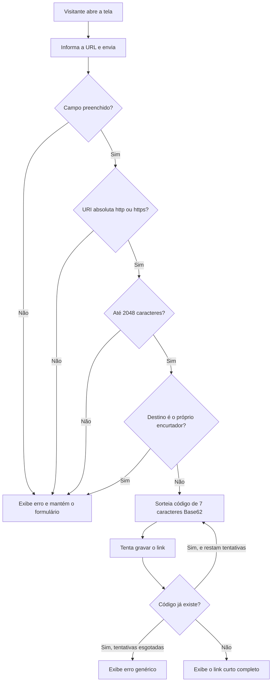
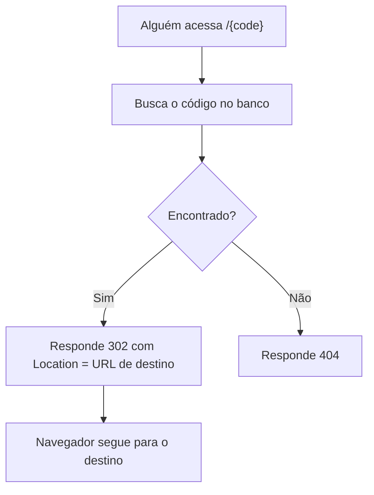
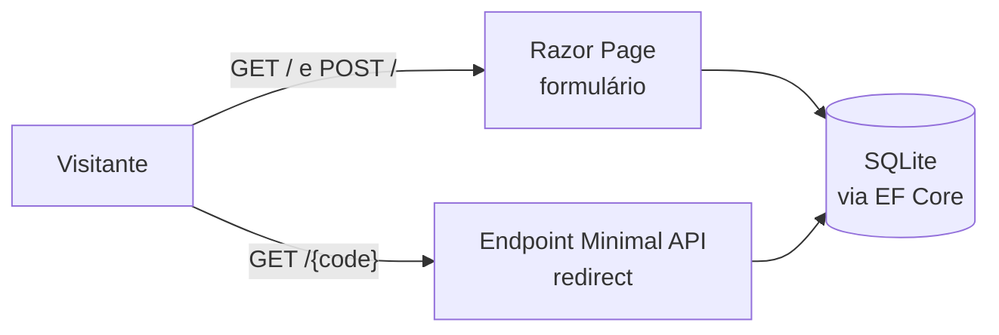

# PRD: Encurtador de URL

**Cliente/Produto:** Interno Leanwork — demo da palestra "Do PRD ao Deploy"
**Tipo:** Epic
**Autor:** Michel Banagouro
**Data:** 2026-08-14
**Status:** Aprovado

---

## 1. Visão geral

Uma aplicação web com **uma única tela**. O visitante cola uma URL longa, clica em encurtar, e recebe de volta um endereço curto no formato `https://host/aB3xK9p`. Quando alguém acessa esse endereço curto, o sistema procura o código no banco e devolve um redirect para a URL original.

É tudo. Não há login, painel, listagem, contagem de cliques nem edição de link. Um dev que nunca viu o projeto deve conseguir ler o sistema inteiro numa sessão.

## 2. Problema e contexto

**Problema:** a palestra "Do PRD ao Deploy" afirma que um pipeline de especificação torna a construção de software com IA previsível. Essa afirmação precisa de um repositório onde a audiência abra o PRD, pegue a regra `RN-10`, encontre o critério `CA-12` que a valida, o teste que carrega esse ID e a tarefa `T-XX` que a implementou. Sem isso, o argumento continua sendo slide.

**Contexto atual:** não existe nada. O diretório do projeto está vazio, com a proposta arquitetural aprovada em `docs/architecture/proposta-arquitetural.md`.

**Impacto de não fazer:** a audiência sai convencida do argumento e sem nenhum artefato concreto para reproduzir na segunda-feira. A palestra perde a prova, e a mentoria Dev .NET IA 10x perde o material de apoio na stack da própria audiência.

## 3. Objetivo

Permitir que qualquer visitante transforme uma URL longa em um link curto funcional, num sistema pequeno o bastante para que 100% de suas regras de negócio sejam rastreáveis até um teste automatizado.

### Métricas de sucesso

- 100% dos critérios de aceite (`CA-XX`) deste documento têm um teste xUnit cujo nome contém o ID (ADR-008).
- Toda regra de negócio (`RN-XX`) que existe por causa de uma decisão arquitetural cita a ADR de origem.
- Em máquina limpa com apenas Docker instalado, o sistema sobe e encurta uma URL sem nenhum passo de configuração.

## 4. Escopo

### 4.1. Dentro do escopo

- Tela única com formulário de uma entrada (a URL) e um botão.
- Validação da URL informada: esquema, tamanho, host de destino, obrigatoriedade.
- Geração de código curto único e persistência do par código ↔ URL.
- Exibição do link curto completo na mesma tela, pronto para cópia.
- Rota de resolução `GET /{code}` com redirect ou 404.
- Criação automática do schema do banco na primeira execução.
- Suíte de testes cobrindo todos os critérios de aceite.
- Empacotamento em imagem Docker.

### 4.2. Fora do escopo

Cada item abaixo é uma decisão, não um esquecimento:

- **Autenticação e cadastro** — qualquer visitante encurta, e nenhum link tem dono. Simplifica o sistema inteiro e é o que justifica os códigos não enumeráveis (RN-06).
- **Painel administrativo e listagem de links** — não há tela para ver o que já foi criado.
- **Métricas, contagem de cliques e analytics** — o redirect não escreve nada (RN-13).
- **Alias customizado** — o usuário não escolhe o código.
- **Expiração, edição ou remoção de link** — um link criado é permanente enquanto o arquivo do banco existir.
- **QR code do link curto** — extensão óbvia, deliberadamente cortada para manter o escopo pequeno.
- **Verificação de reputação do destino** — um link de phishing legítimo em HTTPS passa na validação. Limitação conhecida, registrada na proposta arquitetural.
- **Rate limiting** — não há limite de criação por visitante.
- **Deploy em cloud, domínio próprio e HTTPS com certificado real** — "deploy" aqui significa imagem Docker executável localmente (ADR-007).

## 5. Personas e usuários impactados

| Persona | Papel | Como interage com a feature |
|---------|-------|----------------------------|
| Visitante anônimo | Qualquer pessoa com o endereço da aplicação | Abre a tela, cola uma URL, recebe o link curto. Também é quem acessa um link curto e é redirecionado. Não se identifica em momento algum. |
| Apresentador | Michel, no palco e na mentoria | Mesmo comportamento do visitante, com uma exigência a mais: o sistema precisa se comportar de forma idêntica em execuções repetidas, sem interferência de cache do navegador (RN-10). |
| Leitor do repositório | Participante que clona o projeto depois do evento | Não interage com a aplicação em execução: lê os artefatos e roda a suíte de testes para conferir a rastreabilidade. |

## 6. Hierarquia de entrega

- **Epic:** Encurtador de URL — demo executável do pipeline Leanwork SDD
  - **Feature 1:** Fundação e persistência
    - **PBI 1.1:** Projeto ASP.NET Core 10 (Razor Pages) e projeto de testes xUnit
    - **PBI 1.2:** Entidade de link, `DbContext` e migration inicial com índice único no código
    - **PBI 1.3:** Aplicação automática de migrations na inicialização
  - **Feature 2:** Encurtamento de URL
    - **PBI 2.1:** Validação da URL informada (esquema, tamanho, host próprio, obrigatoriedade)
    - **PBI 2.2:** Geração de código Base62 com tratamento de colisão
    - **PBI 2.3:** Razor Page com formulário, exibição do link curto e mensagens de erro
  - **Feature 3:** Resolução e redirect
    - **PBI 3.1:** Endpoint `GET /{code}` com 302 para código existente e 404 para inexistente
  - **Feature 4:** Empacotamento e execução
    - **PBI 4.1:** Dockerfile multi-stage e README com instruções de execução

> Sugestão de quebra. A ordem importa: a Feature 1 é pré-requisito das demais, e a Feature 3 depende da Feature 2 apenas para ter dado a resolver — as duas podem ser desenvolvidas em paralelo se o banco já existir.

## 7. Fluxos

### 7.1. Fluxo principal — encurtar uma URL



O visitante abre a tela, informa a URL e envia. O sistema aplica as quatro validações em sequência — obrigatoriedade, esquema, tamanho e host de destino — e para na primeira que falhar, devolvendo o formulário com a URL preservada e a mensagem correspondente. Passando nas quatro, sorteia um código e tenta gravar. Se o código já existir, sorteia outro. Gravado, a mesma tela passa a exibir o link curto completo.

Não há redirect após o envio: a resposta de sucesso é a própria tela com o resultado. O link precisa estar visível para ser copiado.

### 7.2. Fluxo de resolução — acessar um link curto



Caminho crítico do produto, deliberadamente sem nada no meio. A busca é exata e sensível a maiúsculas e minúsculas. Código inexistente responde 404, não um redirect para a home — mascarar o erro impediria distinguir "esse link não existe" de "esse link existe e aponta para a home".

### 7.3. Fluxo de inicialização

Ao subir, antes de aceitar qualquer requisição, o sistema aplica as migrations pendentes. Se o arquivo do banco não existir, ele é criado com o schema completo. Isso é o que permite que a primeira execução em máquina limpa funcione sem nenhum comando prévio.

## 8. Regras de negócio

### Validação da URL informada

- **RN-01:** A URL informada deve ser uma URI absoluta com esquema `http` ou `https`. Qualquer outro esquema (`javascript`, `data`, `file`, `ftp`, entre outros) e qualquer entrada sem esquema explícito são rejeitados. A verificação é por allowlist: só passa o que está na lista dos dois. *(ADR-005)*
- **RN-02:** A URL informada não pode exceder 2048 caracteres. *(ADR-005)*
- **RN-03:** A URL de destino não pode ter o mesmo host da requisição que a está criando — encurtar um link do próprio encurtador é rejeitado, porque criaria um laço de redirect. *(ADR-005)*
- **RN-04:** O campo é obrigatório. Entrada vazia ou composta apenas de espaços é rejeitada. Espaços no início e no fim são removidos antes de qualquer outra validação.
- **RN-05:** As validações são aplicadas na ordem RN-04 → RN-01 → RN-02 → RN-03, e a primeira falha interrompe o processo. O visitante vê uma mensagem por vez, correspondente à regra violada.

### Geração e persistência do link

- **RN-06:** O código curto tem exatamente 7 caracteres, sorteados do alfabeto Base62 (`A-Z`, `a-z`, `0-9`) por gerador criptograficamente seguro. O código **não** é derivado de contador sequencial nem de hash da URL — a não-enumerabilidade é o motivo, já que sem autenticação qualquer visitante poderia percorrer os links alheios. *(ADR-003)*
- **RN-07:** O código curto é único em todo o sistema, e a unicidade é garantida pelo banco, não pela aplicação. Em caso de colisão na gravação, o sistema sorteia um novo código e tenta de novo, até 5 tentativas. Esgotadas as tentativas, a operação falha com mensagem genérica e nada é gravado. *(ADR-003, ADR-002)*
- **RN-08:** Encurtar a mesma URL mais de uma vez produz códigos distintos. Não há deduplicação nem reaproveitamento de código: cada envio do formulário cria um registro novo. *(ADR-003)*
- **RN-09:** Cada link persiste três dados: o código curto, a URL de destino exatamente como validada, e a data/hora de criação em UTC.

### Resolução do link curto

- **RN-10:** O acesso a um código existente responde **HTTP 302 (Found)** com o cabeçalho `Location` apontando para a URL de destino. Nunca 301 — navegadores cacheiam 301 de forma persistente, o que faria o navegador parar de consultar o servidor e tornaria o link impossível de corrigir. *(ADR-004)*
- **RN-11:** O acesso a um código inexistente responde **HTTP 404 (Not Found)**. Não há redirect para a home nem página de "link não encontrado" com sugestões. *(ADR-004)*
- **RN-12:** O código é sensível a maiúsculas e minúsculas: `aB3xK9p` e `ab3xk9p` são códigos diferentes, e o segundo não resolve o primeiro. É decorrência direta do alfabeto Base62. *(ADR-003)*
- **RN-13:** A resolução de um link não altera nenhum dado do registro. Não há contagem de acessos, data de último acesso ou qualquer efeito colateral de escrita.

### Apresentação

- **RN-14:** Após o encurtamento bem-sucedido, a tela exibe a URL curta **completa** — esquema, host e código, no formato `https://host/aB3xK9p` — pronta para ser copiada, junto de um controle de cópia.
- **RN-15:** Quando uma validação falha, a tela reexibe o formulário com a URL informada preservada no campo e exibe a mensagem correspondente à regra violada. O visitante não perde o que digitou.

### Inicialização

- **RN-16:** Na inicialização, antes de aceitar requisições, o sistema aplica as migrations pendentes. Se o banco não existir, é criado com o schema completo. *(ADR-006)*

### Mensagens ao visitante

| Regra | Mensagem |
|---|---|
| RN-04 | "Informe uma URL." |
| RN-01 | "Informe uma URL completa, começando com http:// ou https://" |
| RN-02 | "A URL não pode ter mais de 2048 caracteres." |
| RN-03 | "Não é possível encurtar um link do próprio encurtador." |
| RN-07 (esgotado) | "Não foi possível gerar o link agora. Tente novamente." |

## 9. Critérios de aceite

```gherkin
Funcionalidade: Encurtamento de URL
  Para compartilhar endereços longos de forma compacta
  Como visitante anônimo
  Eu quero transformar uma URL longa em um link curto

  Cenário [CA-01]: Encurtamento bem-sucedido de URL válida
    Dado que estou na tela do encurtador
    Quando informo a URL "https://www.exemplo.com.br/artigos/2026/engenharia-de-software"
    Então um link é criado com código de exatamente 7 caracteres do alfabeto Base62 (RN-06)
    E o registro armazena a URL de destino e a data de criação em UTC (RN-09)
    E a tela exibe a URL curta completa, com esquema, host e código (RN-14)

  Esquema do Cenário [CA-02]: Rejeição de URL com esquema ausente ou não permitido (ADR-005)
    Dado que estou na tela do encurtador
    Quando informo a URL <entrada>
    Então o encurtamento é rejeitado (RN-01)
    E recebo a mensagem "Informe uma URL completa, começando com http:// ou https://"
    E nenhum link é criado

    Exemplos:
      | entrada                          |
      | google.com                       |
      | www.exemplo.com.br/pagina        |
      | javascript:alert(1)              |
      | data:text/html,<h1>oi</h1>       |
      | file:///etc/passwd               |
      | ftp://exemplo.com.br/arquivo.zip |
      | //exemplo.com.br                 |

  Cenário [CA-03]: Rejeição de URL acima do limite de caracteres
    Dado que estou na tela do encurtador
    Quando informo uma URL https válida com 2049 caracteres
    Então o encurtamento é rejeitado (RN-02)
    E recebo a mensagem "A URL não pode ter mais de 2048 caracteres."

  Cenário [CA-04]: Aceitação de URL exatamente no limite de caracteres
    Dado que estou na tela do encurtador
    Quando informo uma URL https válida com exatamente 2048 caracteres
    Então o link é criado normalmente (RN-02)

  Cenário [CA-05]: Rejeição de destino apontando para o próprio encurtador
    Dado que o encurtador está sendo acessado no host "curto.local"
    Quando informo a URL "https://curto.local/aB3xK9p"
    Então o encurtamento é rejeitado (RN-03)
    E recebo a mensagem "Não é possível encurtar um link do próprio encurtador."

  Cenário [CA-06]: Rejeição de campo vazio
    Dado que estou na tela do encurtador
    Quando envio o formulário com o campo preenchido apenas com espaços
    Então o encurtamento é rejeitado (RN-04)
    E recebo a mensagem "Informe uma URL."

  Cenário [CA-07]: Espaços nas extremidades são removidos antes da validação
    Dado que estou na tela do encurtador
    Quando informo a URL "  https://www.exemplo.com.br  "
    Então o link é criado com destino "https://www.exemplo.com.br" (RN-04)

  Cenário [CA-08]: Mesma URL encurtada duas vezes gera códigos distintos (ADR-003)
    Dado que a URL "https://www.exemplo.com.br" já foi encurtada anteriormente
    Quando informo a mesma URL novamente
    Então um segundo link é criado com código diferente do primeiro (RN-08)
    E os dois códigos resolvem para o mesmo destino

  Cenário [CA-09]: Colisão de código é resolvida por novo sorteio (ADR-003)
    Dado que já existe um link com o código "aB3xK9p"
    E o gerador sorteia "aB3xK9p" na primeira tentativa
    Quando informo uma nova URL válida
    Então o sistema sorteia um novo código e conclui a gravação (RN-07)
    E o link criado tem código diferente de "aB3xK9p"

  Cenário [CA-10]: Falha após esgotar as tentativas de geração
    Dado que o gerador sorteia sempre um código já existente
    Quando informo uma nova URL válida
    Então o sistema desiste após 5 tentativas (RN-07)
    E recebo a mensagem "Não foi possível gerar o link agora. Tente novamente."
    E nenhum link é gravado

  Cenário [CA-11]: Formulário preserva a entrada após rejeição
    Dado que estou na tela do encurtador
    Quando informo a URL inválida "google.com" e envio
    Então o campo continua preenchido com "google.com" (RN-15)
    E a mensagem de erro correspondente é exibida junto ao campo

  Cenário [CA-17]: Entrada que viola várias regras exibe apenas a primeira violada
    Dado que estou na tela do encurtador
    Quando informo uma entrada com esquema "javascript:" e 3000 caracteres
    Então recebo apenas a mensagem de esquema inválido (RN-05)
    E não recebo a mensagem sobre limite de caracteres
```

```gherkin
Funcionalidade: Resolução de link curto
  Para chegar ao conteúdo original
  Como qualquer pessoa que recebeu um link curto
  Eu quero ser levado ao endereço de destino

  Cenário [CA-12]: Redirect para link existente (ADR-004)
    Dado que existe um link com código "aB3xK9p" apontando para "https://www.exemplo.com.br"
    Quando acesso "/aB3xK9p"
    Então recebo a resposta HTTP 302 (RN-10)
    E o cabeçalho Location contém "https://www.exemplo.com.br"

  Cenário [CA-13]: Resposta 404 para código inexistente (ADR-004)
    Dado que não existe link com o código "zZ9qW1t"
    Quando acesso "/zZ9qW1t"
    Então recebo a resposta HTTP 404 (RN-11)
    E não sou redirecionado para a tela inicial

  Cenário [CA-14]: Código com caixa diferente não resolve (ADR-003)
    Dado que existe um link com código "aB3xK9p"
    Quando acesso "/ab3xk9p"
    Então recebo a resposta HTTP 404 (RN-12)

  Cenário [CA-15]: Resolução não altera o registro do link
    Dado que existe um link com código "aB3xK9p"
    Quando acesso "/aB3xK9p" três vezes seguidas
    Então o registro do link permanece idêntico ao original (RN-13)
    E nenhum dado de acesso é gravado
```

```gherkin
Funcionalidade: Inicialização do sistema

  Cenário [CA-16]: Primeira execução cria o banco automaticamente (ADR-006)
    Dado que o arquivo do banco de dados não existe
    Quando a aplicação é iniciada
    Então o schema é criado com as migrations pendentes aplicadas (RN-16)
    E a aplicação aceita um encurtamento sem nenhum passo manual de configuração
```

## 10. Permissionamento

Não há controle de acesso. Todas as ações — encurtar e resolver — são públicas e anônimas, conforme item 4.2. Esta seção existe para registrar que a ausência é decisão, não omissão, e é justamente ela que torna a RN-06 (códigos não enumeráveis) necessária.

## 11. Integrações e dados

### 11.1. Sistemas envolvidos

Nenhum. O sistema não consome nem expõe API externa, não envia e-mail e não depende de rede após a inicialização.

Vale um esclarecimento porque é contraintuitivo: **a aplicação nunca acessa a URL de destino**. Ela devolve um 302 e o navegador do visitante é quem segue. Não há requisição de saída em momento algum, e é isso que mantém o sistema livre de timeout de terceiro, SSRF e falha em cascata.

### 11.2. Dados consumidos

Apenas a URL digitada pelo visitante e o host da requisição HTTP (necessário para RN-03 e para montar o link curto completo em RN-14).

### 11.3. Dados produzidos / persistidos

Uma tabela de links em SQLite, com:

| Campo | Descrição | Restrição |
|---|---|---|
| Identificador | Chave primária | Autoincremento |
| Código curto | 7 caracteres Base62 | Índice único, obrigatório (RN-07) |
| URL de destino | Endereço validado | Até 2048 caracteres, obrigatório (RN-02) |
| Criado em | Data/hora de criação | UTC, obrigatório (RN-09) |

Nenhum dado pessoal é coletado: sem IP, sem user agent, sem sessão. A ausência de coleta é o que mantém o projeto fora do escopo de LGPD.

## 12. Arquitetura técnica

Detalhada em `docs/architecture/proposta-arquitetural.md`. Resumo do encaixe:



A tela é uma Razor Page; o redirect é um endpoint Minimal API, porque não tem view para renderizar e uma página com rota curinga competiria com todas as demais rotas do site (ADR-001).

## 13. Restrições e premissas

- **Restrição:** stack fixada em .NET 10, Razor Pages, EF Core e SQLite — imposta, não escolhida (ver seção 4 da proposta arquitetural).
- **Restrição:** uma única instância da aplicação. SQLite em arquivo e migration na inicialização inviabilizam múltiplas réplicas, e escala horizontal é não-objetivo declarado.
- **Restrição:** o sistema precisa funcionar sem acesso à internet em tempo de execução.
- **Premissa:** o host acessado pelo visitante é o mesmo host que compõe o link curto exibido. Não há configuração de domínio público diferente do host da requisição.
- **Premissa:** o volume de links criados é da ordem de dezenas. Nenhuma decisão foi tomada em nome de throughput.

## 14. Riscos e dependências

| Tipo | Descrição | Mitigação / Plano |
|------|-----------|-------------------|
| Risco | Cache do navegador falsear o comportamento em palco, fazendo um link antigo continuar funcionando após reset do banco | RN-10 fixa 302 em vez de 301, mantendo toda visita passando pelo servidor. Procedimento de palco: aba anônima |
| Risco | O código gerado pelo agente divergir da especificação sem que ninguém perceba | É o risco que o pipeline endereça: todo `CA-XX` vira teste com o ID no nome (ADR-008), e a fase de review confere plano, PRD e arquitetura |
| Risco | Prazo — a palestra é em 15/08/2026 | Escopo cortado agressivamente (4.2). As Features 1 a 3 entregam um sistema útil como demo mesmo sem a Feature 4 |
| Risco | Reutilização de código curto após reset do banco confundir a demonstração | Já neutralizado por RN-10. Resetar o estado é apagar o arquivo do banco |
| Dependência | Proposta arquitetural aprovada | Concluída — `docs/architecture/proposta-arquitetural.md`, versão 0.1 |
| Dependência | Plano de execução com tarefas `T-XX` | Próxima etapa do pipeline, a ser gerada pela skill `planner-leanwork` |

## 15. Questões em aberto

Nenhuma. As duas decisões que estavam ambíguas foram fechadas durante o levantamento:

- URL sem esquema (`google.com`) é **rejeitada**, não normalizada — fecha RN-01 com uma regra única e literal, sem etapa de normalização e sem casos de borda próprios.
- O resultado do encurtamento é exibido **na mesma tela**, sem redirect após o POST — o link precisa estar visível para ser copiado (RN-14).

## 16. Referências

- `docs/architecture/proposta-arquitetural.md` — proposta arquitetural, versão 0.1, com as ADR-001 a ADR-008 referenciadas neste documento
- `../../README.md` — ficha técnica da palestra "Do PRD ao Deploy", LondrinaTech Meetup, 15/08/2026
