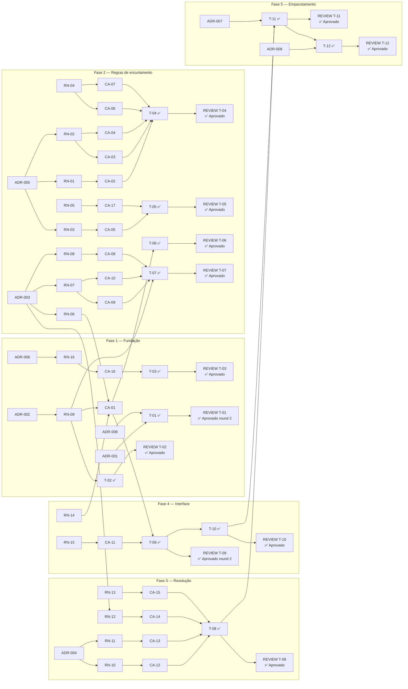

# Matriz de rastreabilidade — PRD-001 Encurtador de URL

**Gerada em:** 2026-08-14 (regenerada após conclusão de T-01 a T-11; atualizada ao fechar T-12)
**Fontes:** `docs/architecture/proposta-arquitetural.md` (v0.1, ADR-001 a ADR-008), `docs/prds/PRD-001-encurtador-url.md` (Aprovado), `docs/plans/PLAN-001-encurtador-url.md`, `docs/reviews/REVIEW-T-*.md`, `tests/Encurtador.Tests/**`

> Análise estática dos artefatos no momento da geração. As 12 tarefas do plano (T-01 a T-12) estão concluídas e revisadas.

---

## Tabela 1 — Rastreabilidade direta (RN → CA → T → ADR → review)

| RN | Descrição (truncada) | Validado por (CA) | Implementado em (T) | Decisão base (ADR) | Status do review |
|----|----|----|----|----|----|
| RN-01 | Esquema http/https por allowlist | CA-02 | T-04 | ADR-005 | ✅ T-04 Aprovado |
| RN-02 | Limite de 2048 caracteres | CA-03, CA-04 | T-04 | ADR-005 | ✅ T-04 Aprovado |
| RN-03 | Rejeita destino no próprio host | CA-05 | T-05 | ADR-005 | ✅ T-05 Aprovado |
| RN-04 | Campo obrigatório, trim antes de validar | CA-06, CA-07 | T-04 | — | ✅ T-04 Aprovado |
| RN-05 | Ordem RN-04→01→02→03, short-circuit | CA-17 | T-05 | — | ✅ T-05 Aprovado |
| RN-06 | Código 7 chars Base62, não enumerável | CA-01 | T-06, T-09 | ADR-003 | ✅ T-06 Aprovado · ✅ T-09 Aprovado (round 2) |
| RN-07 | Unicidade via banco, retry até 5x | CA-09, CA-10 | T-07 | ADR-003, ADR-002 | ✅ T-07 Aprovado |
| RN-08 | Mesma URL gera códigos distintos | CA-08 | T-07 | ADR-003 | ✅ T-07 Aprovado |
| RN-09 | Persiste código, URL, CriadoEm UTC | CA-01 | T-02, T-07, T-09 | — | ✅ T-02 Aprovado · ✅ T-07 Aprovado · ✅ T-09 Aprovado (round 2; bug de `DateTimeKind` corrigido nesta tarefa) |
| RN-10 | 302 (nunca 301) para código existente | CA-12 | T-08 | ADR-004 | ✅ T-08 Aprovado |
| RN-11 | 404 para código inexistente | CA-13 | T-08 | ADR-004 | ✅ T-08 Aprovado |
| RN-12 | Código case-sensitive | CA-14 | T-08 | ADR-003 | ✅ T-08 Aprovado |
| RN-13 | Resolução não altera o registro | CA-15 | T-08 | — | ✅ T-08 Aprovado |
| RN-14 | Exibe URL curta completa | CA-01 | T-09 | — | ✅ T-09 Aprovado (round 2) |
| RN-15 | Preserva entrada e mensagem em falha | CA-11 | T-09 | — | ✅ T-09 Aprovado (round 2) |
| RN-16 | Migration na inicialização | CA-16 | T-03 | ADR-006 | ✅ T-03 Aprovado |

## Tabela 2 — Cobertura reversa (CA → RN → T → teste → review)

| CA | Cenário | Valida (RN) | Implementado em (T) | Teste | Review |
|----|----|----|----|----|----|
| CA-01 | Encurtamento bem-sucedido | RN-06, RN-09, RN-14 | T-09 | `CA_01_UrlValida_CriaLinkEExibeUrlCurtaCompleta` (`EncurtamentoWebTests.cs`) | ✅ |
| CA-02 | Esquema ausente/não permitido | RN-01 | T-04 | `CA_02_UrlComEsquemaAusenteOuNaoPermitido_DeveSerRejeitada` — `[Theory]`, 7 casos (`ValidadorDeUrlTests.cs`) | ✅ |
| CA-03 | Acima do limite de caracteres | RN-02 | T-04 | `CA_03_UrlAcimaDoLimite_DeveSerRejeitada` | ✅ |
| CA-04 | No limite exato | RN-02 | T-04 | `CA_04_UrlNoLimiteExato_DeveSerAceita`, `CA_04_UrlNoLimiteExatoComEspacosNasExtremidades_DeveSerAceita` | ✅ |
| CA-05 | Destino no próprio host | RN-03 | T-05 | `CA_05_DestinoNoProprioHost_DeveSerRejeitado` + variantes caixa/porta | ✅ |
| CA-06 | Campo vazio | RN-04 | T-04 | `CA_06_CampoApenasComEspacos_DeveSerRejeitado` | ✅ |
| CA-07 | Espaços nas extremidades | RN-04 | T-04 | `CA_07_EspacosNasExtremidades_SaoRemovidos` | ✅ |
| CA-08 | Mesma URL duas vezes | RN-08 | T-07 | `CA_08_MesmaUrlEncurtadaDuasVezes_GeraCodigosDistintos` (`ServicoDeEncurtamentoTests.cs`) | ✅ |
| CA-09 | Colisão resolvida por novo sorteio | RN-07 | T-07 | `CA_09_ColisaoDeCodigo_ResolvidaPorNovoSorteio` | ✅ |
| CA-10 | Tentativas esgotadas | RN-07 | T-07 | `CA_10_TentativasEsgotadas_FalhaSemGravar` | ✅ |
| CA-11 | Formulário preserva entrada | RN-15 | T-09 | `CA_11_UrlInvalida_PreservaEntradaEExibeMensagem` (`EncurtamentoWebTests.cs`) | ✅ |
| CA-12 | Redirect 302 | RN-10 | T-08 | `CA_12_CodigoExistente_RetornaTrezentosEDois` (`ResolucaoTests.cs`) | ✅ |
| CA-13 | 404 código inexistente | RN-11 | T-08 | `CA_13_CodigoInexistente_RetornaQuatrocentosEQuatro` | ✅ |
| CA-14 | Case diferente não resolve | RN-12 | T-08 | `CA_14_CodigoComCaixaDiferente_NaoResolve` | ✅ |
| CA-15 | Resolução não altera registro | RN-13 | T-08 | `CA_15_ResolucaoNaoAlteraORegistro` | ✅ |
| CA-16 | Primeira execução cria banco | RN-16 | T-03 | `CA_16_PrimeiraExecucao_CriaBancoAutomaticamente` (`InicializacaoTests.cs`) | ✅ |
| CA-17 | Múltiplas violações, só a primeira | RN-05 | T-05 | `CA_17_EntradaComMultiplasViolacoes_ExibeApenasAPrimeira` (`ValidadorDeUrlTests.cs`) | ✅ |

Os 17 IDs `CA-01` a `CA-17` aparecem em pelo menos um nome de teste. `dotnet test` na raiz: **29/29 aprovados**.

## Tabela 3 — Estado de execução por tarefa

| Tarefa | Status no plano | Commit | Review existe? | Recomendação final | Findings abertos |
|--------|----|----|----|----|----|
| T-01 | ✅ Concluída | `2c74937` | Sim — round 1 + round 2 | Round 1: ⚠️ ressalvas · Round 2: ✅ Aprovado | 0 (R-01, R-02, R-03 do round 1 resolvidos) |
| T-02 | ✅ Concluída | `3dc81a2` | Sim | ✅ Aprovado | 0 |
| T-03 | ✅ Concluída | `c085cfb` | Sim | ✅ Aprovado | 0 (R-01 sugestão, fechada) |
| T-04 | ✅ Concluída | `de813da` | Sim | ✅ Aprovado | 0 (R-01, R-02 sugestões, fechadas) |
| T-05 | ✅ Concluída | `fc1269e` | Sim | ✅ Aprovado | 0 (R-01, R-02 sugestões, fechadas) |
| T-06 | ✅ Concluída | `06b0b41` | Sim | ✅ Aprovado | 0 (R-01 sugestão, fechada) |
| T-07 | ✅ Concluída | `a7e3017` | Sim | ✅ Aprovado | 0 (R-01, R-02 sugestões, fechadas) |
| T-08 | ✅ Concluída | `2da7b44` | Sim | ✅ Aprovado | 0 |
| T-09 | ✅ Concluída | `2d63387` | Sim — round 1 + round 2 | Round 1: ⚠️ ressalvas · Round 2: ✅ Aprovado | 0 (R-01 do round 1 resolvido) |
| T-10 | ✅ Concluída | `061bf20` | Sim | ✅ Aprovado | 0 (R-01, R-02, R-03, R-04 fechados) |
| T-11 | ✅ Concluída | `10b4364` | Sim | ✅ Aprovado, sem ressalvas | 0 (R-01 sugestão opcional, sem ação pendente) |
| T-12 | ✅ Concluída | `d0803d3` | Sim | ✅ Aprovado, sem ressalvas | 0 (R-01 corrigida nesta própria revisão) |

## Diagrama de rastreabilidade

## Lacunas identificadas

- **RNs sem cenário:** nenhuma. As 16 RNs têm ao menos um CA associado.
- **CAs sem tarefa:** nenhum. Os 17 CAs têm `T-XX` declarado em `Valida:` e teste correspondente, todos passando (29/29).
- **Ts sem rastro (`Implementa:`/`Valida:` vazios):** T-01, T-10, T-11, T-12 — **legítimo**: T-01 é estrutural (bootstrap de projeto), T-10 é estilo visual (sem RN/CA por design, conforme o próprio plano declara), T-11 é empacotamento Docker (ADR-007, sem regra de negócio), T-12 é documentação. Nenhum é gap real.
- **ADRs citados mas inexistentes:** nenhum. Todas as referências `ADR-XX` no PRD e no plano (001 a 008) existem na arquitetura.
- **ADRs nunca referenciados por uma RN:** **ADR-001 e ADR-008**. A arquitetura §3.3 declara como meta que "cada ADR desta proposta é referenciada por pelo menos uma regra de negócio do PRD" — essas duas aparecem citadas em prosa do PRD e do plano (arquitetura da aplicação, convenção de teste) mas nenhuma linha `RN-XX` as cita diretamente. **ADR-007 deixou de ser órfã**: T-11 a materializa diretamente (empacotamento Docker), embora, por ser decisão de infraestrutura e não de negócio, também não seja citada por nenhuma RN — mesma natureza de ADR-001/ADR-008. Risco baixo: as três são decisões estruturais/de processo, não regras de negócio — mas vale registrar no README que a meta da própria arquitetura não fecha 100% se lida ao pé da letra.
- **Tarefas Done sem review:** nenhuma. As doze tarefas concluídas (T-01 a T-12) têm review correspondente — `docs/reviews/REVIEW-T-12-2026-08-14.md` inclusa.
- **Reviews bloqueados em aberto:** nenhum. Os dois rounds 1 com ressalvas (T-01 e T-09) têm round 2 subsequente com recomendação final "✅ Aprovado" e os findings marcados "Resolvido".
- **Findings Bloqueantes em tarefas Done:** nenhum. Todas as reviews de tarefas concluídas registram `Bloqueante: 0`.
- **Cobertura de teste declarada no PRD (§3):** "100% dos critérios de aceite têm um teste xUnit cujo nome contém o ID" — **fechada**. Os 17 `CA-XX` aparecem em nomes de teste, suíte 29/29 verde.
